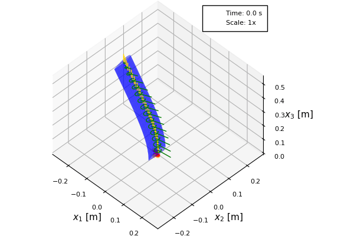
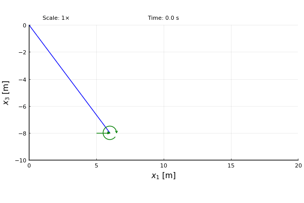

# AeroBeams

| **Documentation**         | **Build Status**                      |
|:------------------------- |:------------------------------------- |
| [![][docs-img]][docs-url] | [![][gh-actions-img]][gh-actions-url] |

## Overview
AeroBeams is a finite-element implementation of the geometrically exact beam theory of [Hodges](#1), augmented with aerodynamic formulations in order to solve aeroelastic problems. The structural part of the code was developed based on the works of [[2]](#2), [[3]](#3) and [[4]](#4), whereas the aerodynamic part follows [[5]](#5), [[6]](#6), [[7]](#7) and [[8]](#8). This package is written in [Julia](https://julialang.org/).

## Installation

To install AeroBeams, simply go to the package manager mode in the Julia REPL by typing ], and then
```julia-repl
pkg> add AeroBeams
```

## Features
The software is a general-purpose aeroelastic solver for flexible aircraft structures that can be modeled as an assembly of anisotropic, initially curved and twisted beams undergoing arbitrarily large displacements and rotations. Multibody dynamics capabilities include only simple hinges.

The assembly of beams can be subjected to time-dependent boundary conditions that can be specified either in a global or local frame of reference, including: 
- Nodal displacements and rotations
- Concentrated, dead or follower nodal forces and moments
- Distributed, dead or follower forces and moments
- Gravitational loads

Other assembly capabilities include:
- Concentrated elemental inertias
- Attached nodal springs

Aerodynamic models are based on strip theory augmented with specified spanwise corrections. The following are available:
- Quasi-steady
- Linear unsteady (indicial [[5]](#5) and inflow [[6]](#6) methods) 
- Dynamic stall (original [[7]](#7) and modified Beddoes-Leishman models [[8]](#8)) 

The beam assembly can also be immersed in gust fields, such as:
- Discrete gusts (sharp-edged, one-minus-cosine, ...)
- Continuous gusts (based on von Kármán or Dryden 2-dimensional spectra)

Four types of analysis can be simulated:
- Steady: when all time derivatives are zero.
- Trim: a steady analysis in which the attitude, flap/elevator deflections and loads (such as thrust) are treated as unknowns (trim variables) to be solved for. 
- Vibration/Stability: an eigenvalue-based (linearized) analysis of small motions about a deformed state.
- Dynamic: time-marching.

A simple built-in post-processing tool allows the visualization of the results. Here is an example of the large-displacement motion of the [Pazy wing](https://nescacademy.nasa.gov/workshops/AePW3/public/wg/largedeflection) benchmark upon encountering a continuous gust (simulated atmospheric turbulence):



Purely structural problems (in the abscence of aerodynamic loads) can analyzed as well, such as the "flying spaghetti" proposed by [[9]](#9):



## Limitations
A few limitations of the theory to keep in mind when using this package:

- The strain measures considered yield a "Timoshenko" beam theory, which is valid for beams of solid or thin-walled, but closed cross-sections, and beams of strip-like cross-sections. It is not accurate for beams of thin-walled, open cross-section (like "C", "I", "L", "T", "Z", etc) for which the warping of the cross-section caused by torsion is important. For these, a "Vlasov" beam theory would be required.
- The force-strain relationship of the material is assumed to be linear, *i.e.*, the strains are assumed to be small.
- Structural damping is not modeled.
- The formulation does not account for the *trapeze effect*, which is the tendency of a twisted beam to untwist (twist) as a traction (compression) force is applied. This effect can be important for beams of open cross-section (whose torsional compliance is high) under axial loads.
- Three-dimensional aerodynamic effects in wings are not modeled directly (such as in panel methods), but rather only through a specified distribution function.

## Related packages
[GXBeam](https://github.com/byuflowlab/GXBeam.jl) is a similar package for solving problems in beam structures. It also makes use of Hodges' equations for Timoshenko beams, though modified to include structural damping. It can also compute the sectional properties (stiffness and inertia matrices) and recover the cross-sectional strains and stresses for arbitrary (geometry- and material-wise) cross sections.

[BeamDyn](https://github.com/old-NWTC/BeamDyn) is a module of the [OpenFAST](https://github.com/OpenFAST/openfast) wind turbine simulation tool. It also employs a geometrically exact beam theory, though it uses Legendre spectral finite elements for faster grid convergence, specially when dealing with varying properties along the beam arclength.

[GEBT](https://cdmhub.org/resources/367) was the first open source implementation of the geometrically exact beam theory proposed by Hodges, as described in [[3]](#3) and [[4]](#4). All previously mentioned packages (including AeroBeams.jl) are based on it.

[SHARPy](https://github.com/ImperialCollegeLondon/sharpy) is an aeroelastic simulation toolbox for very flexible aircraft and wind turbines. On the structural side, it employs a displacement-based geometrically exact beam formulation, whereas the aerodynamic modeling uses the Unsteady Vortex Lattice Method (UVLM) and the Source Panel Method (SPM).

The University of Michigan's Nonlinear Aeroelastic Simulation Toolbox (UM/NAST) is a framework for simulating the flight dynamics of flexible aircraft structures modeled as an assembly of beams. It implements a strain-based geometrically exact beam theory, as described in [[10]](#10). It is not, however, an open source code.

## References
<a id="1">[1]</a> Hodges, D. H. "Nonlinear Composite Beam Theory". 2006. American Institute of Aeronautics and Astronautics. [10.2514/4.866821](https://doi.org/10.2514/4.866821)

<a id="2">[2]</a> Hodges, D. H., Shang, X. and Cesnik, C. E. S. "Finite element solution of nonlinear intrinsic equations for curved composite beams". 1996. Journal of the American Helicopter Society. [10.2514/6.1995-1174](https://doi.org/10.2514/6.1995-1174)

<a id="3">[3]</a> Yu, W. and Blair, M. "GEBT: A general-purpose nonlinear analysis tool for composite beams". 2012. Composite Structures. [10.1016/j.compstruct.2012.04.007](https://doi.org/10.1016/j.compstruct.2012.04.007)

<a id="4">[4]</a> Wang, Q. and Yu, W. "Geometrically nonlinear analysis of composite beams using Wiener-Milenković parameters". 2017. Journal of Renewable and Sustainable Energy. [10.1063/1.4985091](https://doi.org/10.1063/1.4985091)

<a id="5">[5]</a> Leishman, J. G. "Principles of Helicopter Aerodynamics". 2006. Cambridge University Press.

<a id="6">[6]</a> Peters, D. A., Karunamoorthy, S. and Cao, W. "Finite state induced flow models. I: Two-dimensional thin airfoil". 1995. Journal of Aircraft. [10.2514/3.46718](https://doi.org/10.2514/3.46718)

<a id="7">[7]</a> Leishman, J. G. and Beddoes, T. S. "A Semi‐Empirical Model for Dynamic Stall". 1989. Journal of the American Helicopter Society. [10.4050/JAHS.34.3.3](https://doi.org/10.4050/JAHS.34.3.3)

<a id="8">[8]</a> dos Santos, L. G. P. and Marques, F. D. "Improvements on the Beddoes-Leishman dynamic stall model for low speed applications". 2021. Journal of Fluids and Structures. [10.1016/j.jfluidstructs.2021.103375](https://doi.org/10.1016/j.jfluidstructs.2021.103375)

<a id="9">[9]</a> J. C. Simo and L. Vu-Quoc. "On the Dynamics of Flexible Beams Under Large Overall Motions—The Plane Case: Part II". 1986. Journal of Applied Mechanics. [10.1115/1.3171871](https://doi.org/10.1115/1.3171871)

<a id="10">[10]</a> Su, W and Cesnik, C. E. S. "Strain-based geometrically nonlinear beam formulation for modeling very flexible aircraft". 2011. International Journal of Solids and Structures. [10.1016/j.ijsolstr.2011.04.012](https://doi.org/10.1016/j.ijsolstr.2011.04.012)


[docs-img]: https://img.shields.io/badge/docs-dev-blue.svg
[docs-url]: https://luizpancini.github.io/AeroBeams.jl/dev/

[gh-actions-img]: https://github.com/luizpancini/AeroBeams.jl/actions/workflows/CI.yml/badge.svg?branch=main
[gh-actions-url]: https://github.com/luizpancini/AeroBeams.jl/actions/workflows/CI.yml?query=branch%3Amain
