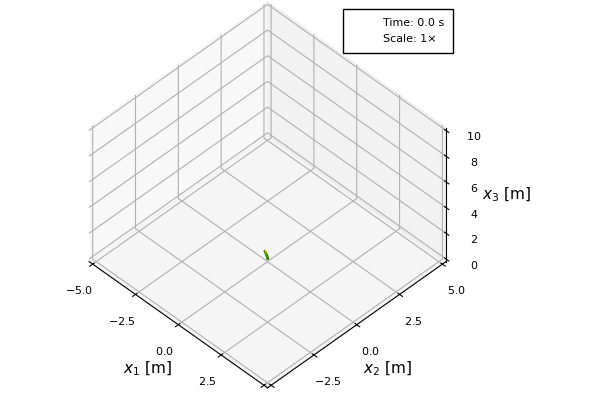

# AeroBeams

## Overview
AeroBeams is a finite-element implementation of the geometrically exact beam theory of [Hodges](#1), augmented with aerodynamic formulations in order to solve aeroelastic problems. The structural part of the code was developed based on the works of [[2]](#2), [[3]](#3) and [[4]](#4), whereas the aerodynamic part follows [[5]](#5), [[6]](#6) and [[7]](#7), all written in [Julia](https://julialang.org/).

## Features
The software is a general-purpose aeroelastic solver for fixed-wing aircraft structures that can be modeled as an assembly of anisotropic, initially curved and twisted beams, subjected to arbitrary (but consistent) boundary conditions, undergoing arbitrarily large displacements and rotations (but small strains), and dynamic stall, while immersed in a gust field. It can handle four types of analysis:

- Steady: when all time derivatives are zero.
- Trim: a steady analysis in which the attitude, flap/elevator deflections and loads (such as thrust) are treated as unknowns to be solved for. 
- Vibration/Stability: an eigenvalue-based (linearized) analysis of small motions about a deformed state.
- Dynamic: time-marching.

A simple built-in post-processing tool allows the visualization of the results. Here is an example of the large-displacement motion of the [Pazy](https://nescacademy.nasa.gov/workshops/AePW3/public/wg/largedeflection) wing benchmark upon encountering a continuous gust (simulated atmospheric turbulence):

Purely structural problems (in the abscence of aerodynamic loads) can also be solved, such as the "flying spaghetti" proposed by [[8]](#8):

## References
<a id="1">[1]</a> Hodges, D. H. "Nonlinear Composite Beam Theory". 2006. American Institute of Aeronautics and Astronautics. [10.2514/4.866821](https://doi.org/10.2514/4.866821)

<a id="2">[2]</a> Hodges, D. H., Shang, X. and Cesnik, C. E. S. "Finite element solution of nonlinear intrinsic equations for curved composite beams". 1996. Journal of the American Helicopter Society. [10.2514/6.1995-1174](https://doi.org/10.2514/6.1995-1174)

<a id="3">[3]</a> Yu, W. and Blair, M. "GEBT: A general-purpose nonlinear analysis tool for composite beams". 2012. Composite Structures. [10.1016/j.compstruct.2012.04.007](https://doi.org/10.1016/j.compstruct.2012.04.007)

<a id="4">[4]</a> Wang, Q. and Yu, W. "Geometrically nonlinear analysis of composite beams using Wiener-Milenković parameters". 2017. Journal of Renewable and Sustainable Energy. [10.1063/1.4985091](https://doi.org/10.1063/1.4985091)

<a id="5">[5]</a> Leishman, J. G. "Principles of Helicopter Aerodynamics". 2006. Cambridge University Press.

<a id="6">[6]</a> Peters, D. A., Karunamoorthy, S. and Cao, W. "Finite state induced flow models. I: Two-dimensional thin airfoil". 1995. Journal of Aircraft. [10.2514/3.46718](https://doi.org/10.2514/3.46718)

<a id="7">[7]</a> dos Santos, L. G. P. and Marques, F. D. "Improvements on the Beddoes-Leishman dynamic stall model for low speed applications". 2021. Journal of Fluids and Structures. [10.1016/j.jfluidstructs.2021.103375](https://doi.org/10.1016/j.jfluidstructs.2021.103375)

<a id="8">[8]</a> J. C. Simo and L. Vu-Quoc. "On the Dynamics of Flexible Beams Under Large Overall Motions—The Plane Case: Part I". 1986. Journal of Applied Mechanics. [10.1115/1.3171870](https://doi.org/10.1115/1.3171870)
