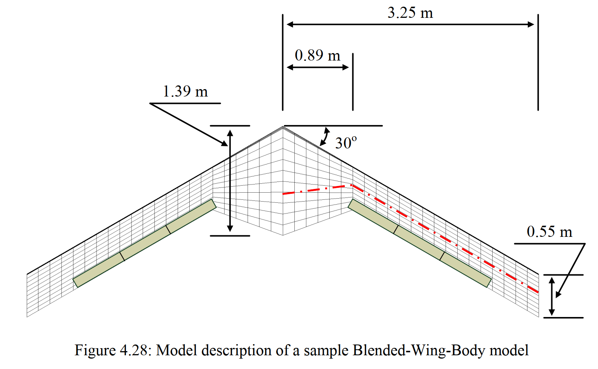

```@meta
EditURL = "../../test/examples/BWBflutter.jl"
```

# Flutter of a Blended-Wing-Body
This example illustrates how to set up a flutter analysis of an aircraft in free flight. For that we take the Blended-Wing-Body vehicle, a swept flying-wing with trailing-edge control surfaces. This aircraft model was described in [Weihua Su's PhD thesis](https://www.proquest.com/docview/304572531?pq-origsite=gscholar&fromopenview=true&sourcetype=Dissertations%20&%20Theses):



### Problem setup
Let's begin by setting up the variables of our problem.

````@example BWBflutter
using AeroBeams, DelimitedFiles

# Aerodynamic solver
aeroSolver = Indicial()

# Flight altitude
h = 0e3

# Airspeed range
URange = collect(30:5:150)

# Number of vibration modes
nModes = 8

# Pre-allocate memory and initialize output arrays
trimAoA = Array{Float64}(undef,length(URange))
trimThrust = Array{Float64}(undef,length(URange))
trimδ = Array{Float64}(undef,length(URange))
untrackedFreqs = Array{Vector{Float64}}(undef,length(URange))
untrackedDamps = Array{Vector{Float64}}(undef,length(URange))
untrackedEigenvectors = Array{Matrix{ComplexF64}}(undef,length(URange))
freqs = Array{Vector{Float64}}(undef,length(URange))
damps = Array{Vector{Float64}}(undef,length(URange))
nothing #hide
````

For the trim problem, we set a Newton-Raphson solver for the system of equations, with the adequate relaxation factor for trim problems (`relaxFactor = 0.5`), and an increased number of maximum iterations (`maxiter = 50`, the default is 20).

````@example BWBflutter
# System solver
relaxFactor = 0.5
maxiter = 50
NR = create_NewtonRaphson(ρ=relaxFactor,maximumIterations=maxiter)
nothing #hide
````

Next, we address an important step to be taken when performing flutter analyses in free flight with AeroBeams: to attach the model to light springs in displacement and rotation. This step is necessary for the solver to find the flight dynamic (rigid-body) modes of the vehicle, by introducing some sensitivity of the finite element states to those degrees-of-freedom. In the present case, we will attach two springs to the vehicle, one at each of the nodes where the transition from the body (fuselage) to the wing begins. An appropriate value for the stiffness of the springs is specified by the variable `μ`. The vectors `ku` and `kp` denote the stiffness values in the three orthogonal directions.

````@example BWBflutter
# Attachment springs
μ = 1e-2
ku = kp = μ*[1; 1; 1]
spring1 = create_Spring(elementsIDs=[1],nodesSides=[1],ku=ku,kp=kp)
spring2 = create_Spring(elementsIDs=[3],nodesSides=[2],ku=ku,kp=kp)
nothing #hide
````

### Problem solution
At this point we can sweep the airspeed vector to find the solution at each value.

````@example BWBflutter
# Sweep airspeed range
for (i,U) in enumerate(URange)
    # The first step of the solution is to trim the aircraft at that flight condition (combination of altitude and airspeed). We leverage the built-in function in AeroBeams to create our model for trim problem.
    BWBtrim = create_BWB(aeroSolver=aeroSolver,δElevIsTrimVariable=true,thrustIsTrimVariable=true,altitude=h,airspeed=U)

    # Next, we add the springs to model, and update it (while also skipping the validation of the specified motion of body-attached basis A).
    add_springs_to_beam!(beam=BWBtrim.beams[2],springs=[spring1])
    add_springs_to_beam!(beam=BWBtrim.beams[3],springs=[spring2])
    BWBtrim.skipValidationMotionBasisA = true
    update_model!(BWBtrim)

    # To increase the rate of convergence, we may set initial an guess solution for the trim problem as the known solution at the previous airspeed (except at the first one).
    x0Trim = i == 1 ? zeros(0) : trimProblem.x

    # Now we create and solve the trim problem.
    global trimProblem = create_TrimProblem(model=BWBtrim,systemSolver=NR,x0=x0Trim)
    solve!(trimProblem)

    # We extract the trim variables at the current airspeed and set them into our pre-allocated arrays. The trimmed angle of attack at the root, `trimAoA[i]`, is not necessary for the flutter analyses, it is merely an output of interest.
    trimAoA[i] = trimProblem.aeroVariablesOverσ[end][BWBtrim.beams[3].elementRange[1]].flowAnglesAndRates.αₑ
    trimThrust[i] = trimProblem.x[end-1]*BWBtrim.forceScaling
    trimδ[i] = trimProblem.x[end]

    # All the variables needed for the stability analysis are now in place.We create the model for eigenproblem, using the trim variables found previously in order to solve for the stability around that exact state.
    BWBeigen = create_BWB(aeroSolver=aeroSolver,altitude=h,airspeed=U,δElev=trimδ[i],thrust=trimThrust[i])

    # Again, we add the springs to model, and update it (while also skipping the validation of the specified motion of body-attached basis A).
    add_springs_to_beam!(beam=BWBeigen.beams[2],springs=[spring1])
    add_springs_to_beam!(beam=BWBeigen.beams[3],springs=[spring2])
    BWBeigen.skipValidationMotionBasisA = true
    update_model!(BWBeigen)

    # Now we create and solve eigenproblem. Notice that by using `solve_eigen!()`, we skip the step of finding the steady state of the problem, leveraging the known trim solution (composed of the Jacobian and inertia matrices of the system). We apply a filter to find only modes whose frequencies are greater than 1 rad/s through the keyword argument `frequencyFilterLimits`
    global eigenProblem = create_EigenProblem(model=BWBeigen,nModes=nModes,frequencyFilterLimits=[1e0,Inf64],jacobian=trimProblem.jacobian[1:end,1:end-trimProblem.model.nTrimVariables],inertia=trimProblem.inertia)
    solve_eigen!(eigenProblem)

    # The final step in the loop is extracting the frequencies, dampings and eigenvectors of the solution
    untrackedFreqs[i] = eigenProblem.frequenciesOscillatory
    untrackedDamps[i] = round_off!(eigenProblem.dampingsOscillatory,1e-12)
    untrackedEigenvectors[i] = eigenProblem.eigenvectorsOscillatoryCplx
end
nothing #hide
````

### Post-processing
We can use the built-in mode tracking function to enhance the chances of correctly tracking the frequencies and dampings of each mode

````@example BWBflutter
# Mode tracking
freqs,damps,_,matchedModes = mode_tracking(URange,untrackedFreqs,untrackedDamps,untrackedEigenvectors)

# Separate frequencies and damping ratios by mode
modeDampings = Array{Vector{Float64}}(undef,nModes)
modeFrequencies =  Array{Vector{Float64}}(undef,nModes)
for mode in 1:nModes
    modeDampings[mode] = [damps[i][mode] for i in eachindex(URange)]
    modeFrequencies[mode] = [freqs[i][mode] for i in eachindex(URange)]
end
nothing #hide
````

We can load the reference solution found with the University of Michigan's Nonlinear Aeroelastic Simulation Tool (UM/NAST)

````@example BWBflutter
# Load reference data
trimAoARef = readdlm(pkgdir(AeroBeams)*"/test/referenceData/BWB/trimAoA.txt")
trimThrustRef = readdlm(pkgdir(AeroBeams)*"/test/referenceData/BWB/trimThrust.txt")
trimδRef = readdlm(pkgdir(AeroBeams)*"/test/referenceData/BWB/trimDelta.txt")
nothing #hide
````

We are ready to plot the results. The following plots show the trim root angle of attack, motor thrust and elevator deflection as functions of the airspeed. The correlation with the reference solution is very good.

````@example BWBflutter
using Plots, ColorSchemes
pyplot()
nothing #hide
using Suppressor #hide

# Root AoA
@suppress_err begin #hide
plt1 = plot(xlabel="Airspeed [m/s]", ylabel="Trim root AoA [deg]", xlims=[URange[1],URange[end]])
plot!(URange, trimAoA*180/π, c=:black, lw=2, label="AeroBeams")
scatter!(trimAoARef[1,:],trimAoARef[2,:], c=:black, ms=4, label="UM/NAST")
savefig("BWBflutter_AoA.svg") #hide
end #hide
nothing #hide

# Thrust
@suppress_err begin #hide
plt2 = plot(xlabel="Airspeed [m/s]", ylabel="Trim thrust [N]", xlims=[URange[1],URange[end]], legend=:bottomright)
plot!(URange, trimThrust, c=:black, lw=2, label="AeroBeams")
scatter!(trimThrustRef[1,:],trimThrustRef[2,:], c=:black, ms=4, label="UM/NAST")
savefig("BWBflutter_thrust.svg") #hide
end #hide
nothing #hide

# Elevator deflection
@suppress_err begin #hide
plt3 = plot(xlabel="Airspeed [m/s]", ylabel="Trim elevator deflection [deg]", xlims=[URange[1],URange[end]], legend=:bottomright)
plot!(URange, trimδ*180/π, c=:black, lw=2, label="AeroBeams")
scatter!(trimδRef[1,:],trimδRef[2,:], c=:black, ms=4, label="UM/NAST")
savefig("BWBflutter_delta.svg") #hide
end #hide
nothing #hide
````


````@example BWBflutter
nothing #hide
````


````@example BWBflutter
nothing #hide
````


````@example BWBflutter
nothing #hide
````

The stability results can be visualized through the following root locus and V-g-f (frequency and damping evolution) plots. It is seen that one of the modes crosses the zero-damping barrier, indicating flutter. Also notice that the mode tracking works well in this particular example, but a change in parameters may affect its behavior.

````@example BWBflutter
# Colormap
cmap = :rainbow
modeColors = get(colorschemes[cmap], LinRange(0, 1, nModes))
# Root locus
@suppress_err begin #hide
plt4 = plot(xlabel="Damping [1/s]", ylabel="Frequency [rad/s]", xlims=[-20,5],ylims=[0,120])
for mode in 1:nModes
scatter!(modeDampings[mode], modeFrequencies[mode], c=modeColors[mode], ms=4, msw=0, label=false)
end
savefig("BWBflutter_rootlocus.svg") #hide
end #hide
nothing #hide
# V-g-f
@suppress_err begin #hide
plt51 = plot(ylabel="Frequency [rad/s]", xlims=[URange[1],URange[end]], ylims=[0,120])
for mode in 1:nModes
scatter!(URange, modeFrequencies[mode], c=modeColors[mode], ms=4, msw=0, label=false)
end
plt52 = plot(xlabel="Airspeed [m/s]", ylabel="Damping [1/s]", xlims=[URange[1],URange[end]], ylims=[-10,5])
for mode in 1:nModes
scatter!(URange, modeDampings[mode], c=modeColors[mode], ms=4, msw=0,label=false)
end
plt5 = plot(plt51,plt52, layout=(2,1))
savefig("BWBflutter_Vgf.svg") #hide
end #hide
nothing #hide
````


````@example BWBflutter
nothing #hide
````


````@example BWBflutter
nothing #hide
````

Finally, we may visualize the mode shapes of the last eigenproblem (at highest airspeed), making use of the `plot_mode_shapes()` function with the appropriate inputs. Modes 1 and 2 seem to be lateral-directional and longitudinal flight dynamic modes, whereas the others are structural.

````@example BWBflutter
modesPlot = plot_mode_shapes(eigenProblem,scale=1,view=(30,30),legendPos=:outerright,modalColorScheme=cmap)
savefig("BWBflutter_modeShapes.svg") #hide
nothing #hide
````


````@example BWBflutter
nothing #hide
````

---

*This page was generated using [Literate.jl](https://github.com/fredrikekre/Literate.jl).*

