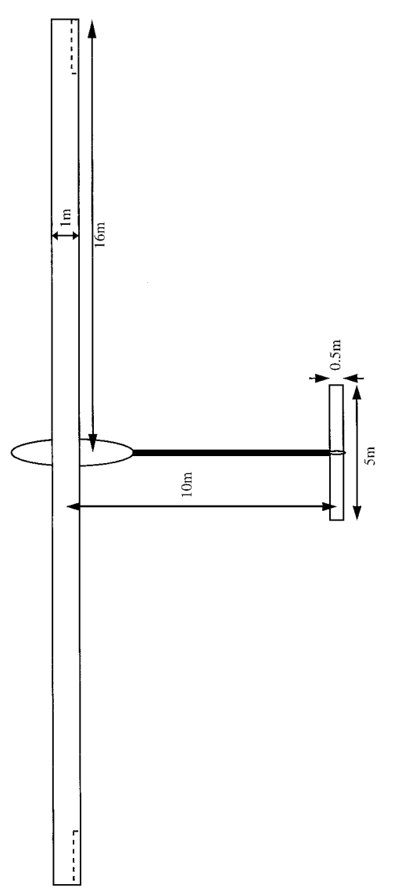
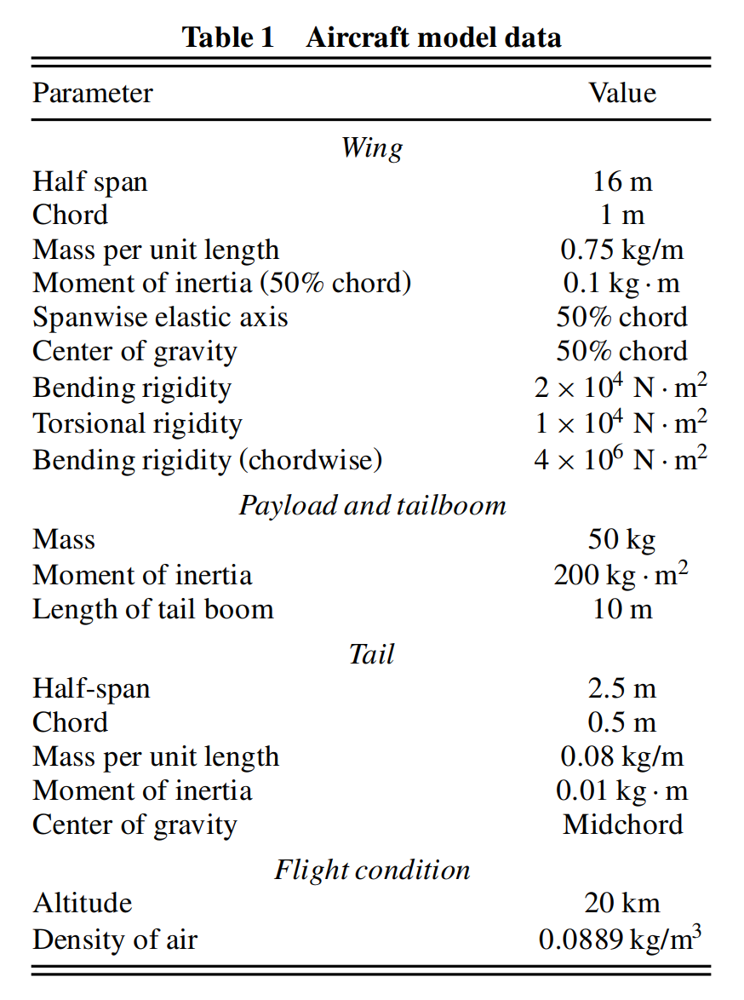

```@meta
EditURL = "../../test/examples/conventionalHALEmodel.jl"
```

# Creating a HALE aircraft model
This example illustrates how to create a conventional aircraft model, the high-altitude long-endurance (HALE) aircraft described by [Patil, Hodges and Cesnik](https://doi.org/10.2514/2.2738):


*HALE model geometry*


*HALE model data*

The contents of the present example are wrapped into the function [`create_conventional_HALE`](@ref create_conventional_HALE), in which you may check all the keyword arguments that we'll define below.

````@example conventionalHALEmodel
# Define input arguments
using AeroBeams

altitude=20e3
aeroSolver=Indicial()
derivationMethod=AD()
flapLoadsSolver=TableLookup()
gustLoadsSolver=IndicialGust("Kussner")
stabilizersAero=true
includeVS=true
wAirfoil=deepcopy(flatPlate)
sAirfoil=deepcopy(flatPlate)
nElemWing=20
nElemHorzStabilizer=10
nElemTailBoom=10
nElemVertStabilizer=5
∞=1e12
stiffnessFactor=1
k1=0
k2=0
airspeed=0
δElevIsTrimVariable=false
thrustIsTrimVariable=false
δElev=nothing
thrust=0
g=-9.80665
wingCd0=0
wingcnδ=2.5
wingcmδ=-0.35
wingcdδ=0.15
stabsCd0=0
stabscnδ=2.5
stabscmδ=-0.35
stabscdδ=0.15
nothing #hide
````

### Validation
The first step is the validation of the inputs, for which reasonable values are necessary.

````@example conventionalHALEmodel
# Validate
@assert iseven(nElemWing)
@assert iseven(nElemHorzStabilizer)
@assert ∞ > 1e8
@assert stiffnessFactor > 0
@assert wingCd0 >= 0
@assert stabsCd0 >= 0
@assert airspeed >= 0
δElevIsInput = !isnothing(δElev)
if δElevIsInput
    @assert !δElevIsTrimVariable
end
if δElev isa Number
    δElevConst = deepcopy(δElev)
    δElev = t -> δElevConst
end
if thrust isa Number
    thrustConst = deepcopy(thrust)
    thrust = t -> thrustConst
end
nothing #hide
````

### Atmosphere
Let's initialize an instance of the International Standard Atmosphere (ISA) at the specified altitude using the function [`standard_atmosphere`](@ref standard_atmosphere).

````@example conventionalHALEmodel
# Atmosphere
atmosphere = standard_atmosphere(altitude)
nothing #hide
````

### Wing aerodynamic surface
In AeroBeams, each beam can have an aerodynamic surface attached to it. The wing surface is defined by an airfoil, `wAirfoil`, the normalized position of the beam's reference line (spar) on the chord, `wNormSparPos`, the normalized position of the flap (aileron) hinge on the chord, `wNormFlapPos`, and the normalized endpoints of the flap (aileron) span over the beam's arclength, `wNormFlapSpan`. We update the airfoil parameters to the specified atmospheric conditions using the function [`update_Airfoil_params!`](@ref update_Airfoil_params!). To create an aerodynamic surface, we use the function [`create_AeroSurface`](@ref create_AeroSurface).

````@example conventionalHALEmodel
# Wing surface
wChord = 1
wNormSparPos = 0.5
wNormFlapPos = 0.75
wNormFlapSpan = [0.75,1]
update_Airfoil_params!(wAirfoil,Ma=airspeed/atmosphere.a,U=airspeed,b=wChord/2)
wingSurf = create_AeroSurface(solver=aeroSolver,gustLoadsSolver=gustLoadsSolver,derivationMethod=derivationMethod,flapLoadsSolver=flapLoadsSolver,airfoil=wAirfoil,c=wChord,normSparPos=wNormSparPos,normFlapPos=wNormFlapPos,normFlapSpan=wNormFlapSpan,updateAirfoilParameters=false)
nothing #hide
````

 We then override the appropriate parameters of the airfoil with those input by the user.

````@example conventionalHALEmodel
# Override wing airfoil parameters
wingSurf.airfoil.attachedFlowParameters.cd₀ = wingCd0
wingSurf.airfoil.parametersBLi.cd₀ = wingCd0
wingSurf.airfoil.parametersBLo.cd₀ = wingCd0
wingSurf.airfoil.flapParameters.cnδ = wingcnδ
wingSurf.airfoil.flapParameters.cmδ = wingcmδ
wingSurf.airfoil.flapParameters.cdδ = wingcdδ
nothing #hide
````

### Wing beam (spar)
Next, we'll define the structural properties of the beam. Notice that we have the option of specifying a stiffness factor, `stiffnessFactor`, for the relevant properties of the wing. We then use the built-in functions [`isotropic_stiffness_matrix`](@ref isotropic_stiffness_matrix) and [`inertia_matrix`](@ref inertia_matrix) to create the sectional stiffness (force-strain relations) and inertia (velocity-displacement relation) matrices.

````@example conventionalHALEmodel
# Beam properties
Lw = 16
wGJ,wEIy,wEIz = 1e4,2e4,4e6
wGJ,wEIy,wEIz = AeroBeams.multiply_inplace!(stiffnessFactor, wGJ,wEIy,wEIz)
wρA,wρIs = 0.75,0.1
wρIy,wρIz = (wEIy/wEIz)*wρIs,(1-wEIy/wEIz)*wρIs
Cwing = isotropic_stiffness_matrix(∞=∞,GJ=wGJ,EIy=wEIy,EIz=wEIz)
Iwing = inertia_matrix(ρA=wρA,ρIy=wρIy,ρIz=wρIz,ρIs=wρIs)
nothing #hide
````

In order to position the center of the wing at the origin of the frame A, we need the position of the first node of the assembly, at the left wingtip. That `initialPosition` vector will be a function of the undeformed wing curvature `k2` (which is zero in the original model). Similarly, the initial angle of twist of the wing, `ψ`, is a function of the undeformed wing twist curvature, `k1` (also zero in the original model).

````@example conventionalHALEmodel
# Initial position for first node of left wing
ρ = 1/k2
θ = Lw/ρ
x = ρ*sin(θ)
z = ρ*(1-cos(θ))
initialPosition = k2 == 0 ? [-Lw; 0; 0] : [-x; 0; -z]

# Initial angle of twist
r = 1/k1
ψ = Lw/r
nothing #hide
````

To create the beams of the left and right wings, we use the function [`create_Beam`](@ref create_Beam). The rotation parameters from the underformed beam basis (b) to the global basis (A), namely `p0`, are set for the left wing such that the left and right wings become symmetric about the x1-plane of basis A. We also create an antissymetric link between the ailerons of the left and right wings, using the function [`create_FlapLink`](@ref create_FlapLink).

````@example conventionalHALEmodel
# Wing beams
leftWing = create_Beam(name="leftWing",length=Lw,nElements=div(nElemWing,2),C=[Cwing],I=[Iwing],aeroSurface=deepcopy(wingSurf),k=[-k1;k2;0],rotationParametrization="E321",p0=[0;-θ;-ψ])

rightWing = create_Beam(name="rightWing",length=Lw,nElements=div(nElemWing,2),C=[Cwing],I=[Iwing],aeroSurface=deepcopy(wingSurf),k=[k1;k2;0],connectedBeams=[leftWing],connectedNodesThis=[1],connectedNodesOther=[div(nElemWing,2)+1])

# Link wing ailerons
aileronLink = create_FlapLink(masterBeam=rightWing,slaveBeams=[leftWing],δMultipliers=[-1])
nothing #hide
````

### Payload
The payload is modeled as a point inertia at the center of the wing spar. It is created with the constructor [`PointInertia`](@ref PointInertia), and then added to the center of the wing through the function [`add_point_inertias_to_beam!`](@ref add_point_inertias_to_beam!).

````@example conventionalHALEmodel
# Payload
payloadMass = 50
payloadInertia = 200
payload = PointInertia(elementID=1,η=[-Lw/div(nElemWing,2)/2;0;0],mass=payloadMass,Iyy=payloadInertia,Izz=payloadInertia,Ixx=payloadInertia)
add_point_inertias_to_beam!(rightWing,inertias=[payload])
nothing #hide
````

### Tail boom
The tail boom is assumed to be a rigid beam, devoid of aerodynamic surfaces, and rigidly connected to wing spar. Some of its sectional inertia matrix properties are assumed with reasonable values, since they are not given in the reference.

````@example conventionalHALEmodel
# Tail boom
Lt = 10
tρA,tρIy,tρIz = 0.08,wρIy/10,wρIz/10
tailBoom = create_Beam(name="tailBoom",length=Lt,nElements=nElemTailBoom,C=[isotropic_stiffness_matrix(∞=∞)],I=[inertia_matrix(ρA=tρA,ρIy=tρIy,ρIz=tρIz)],rotationParametrization="E321",p0=[-π/2;0;0],connectedBeams=[rightWing],connectedNodesThis=[1],connectedNodesOther=[1])
nothing #hide
````

### Horizontal stabilizer
The horizontal stabilizer's aerodynamic surface is constructed similarly to the wing's, though it depends on whether the elevator deflecton is a trim variable or not (through the flags `δElevIsTrimVariable` and `δElevIsInput`).

````@example conventionalHALEmodel
# Horizontal stabilizer surface
hChord = 0.5
hNormSparPos = 0.5
hNormFlapPos = 0.75
hNormFlapSpan = [0,1]
update_Airfoil_params!(sAirfoil,Ma=airspeed/atmosphere.a,U=airspeed,b=hChord/2)
hsSurf = δElevIsInput ? create_AeroSurface(solver=aeroSolver,gustLoadsSolver=gustLoadsSolver,derivationMethod=derivationMethod,flapLoadsSolver=flapLoadsSolver,airfoil=sAirfoil,c=hChord,normSparPos=hNormSparPos,normFlapPos=hNormFlapPos,normFlapSpan=hNormFlapSpan,δ=δElev,updateAirfoilParameters=false) : create_AeroSurface(solver=aeroSolver,gustLoadsSolver=gustLoadsSolver,derivationMethod=derivationMethod,flapLoadsSolver=flapLoadsSolver,airfoil=sAirfoil,c=hChord,normSparPos=hNormSparPos,normFlapPos=hNormFlapPos,normFlapSpan=hNormFlapSpan,δIsTrimVariable=δElevIsTrimVariable,updateAirfoilParameters=false)

# Override horizontal stabilizer airfoil parameters
hsSurf.airfoil.attachedFlowParameters.cd₀ = stabsCd0
hsSurf.airfoil.parametersBLi.cd₀ = stabsCd0
hsSurf.airfoil.parametersBLo.cd₀ = stabsCd0
hsSurf.airfoil.flapParameters.cnδ = stabscnδ
hsSurf.airfoil.flapParameters.cmδ = stabscmδ
hsSurf.airfoil.flapParameters.cdδ = stabscdδ
nothing #hide
````

The horizontal stabilizer beam (spar) is also created analogously to the wing, albeit now we input the `initialPosition` keyword to [`create_Beam`](@ref create_Beam) in order to the define the position of the stabilizer's left tip. The aerodynamic surface is only attached to the wing if the flag `stabilizersAero` is true, using the function [`update_beam!`](@ref update_beam!).

````@example conventionalHALEmodel
# Horizontal stabilizer beam
Lh = 5
hρA,hρIy,hρIz = 0.08,wρIy/10,wρIz/10
horzStabilizer = create_Beam(name="horzStabilizer",length=Lh,initialPosition=[-Lh/2;0;0],nElements=nElemHorzStabilizer,C=[isotropic_stiffness_matrix(∞=∞)],I=[inertia_matrix(ρA=hρA,ρIy=hρIy,ρIz=hρIz)],connectedBeams=[tailBoom],connectedNodesThis=[div(nElemHorzStabilizer,2)+1],connectedNodesOther=[nElemTailBoom+1])
if stabilizersAero
    horzStabilizer.aeroSurface = hsSurf
    update_beam!(horzStabilizer)
end
nothing #hide
````

### Vertical stabilizer
The construction of the vertical stabilizer is again similar to that of the wing and horizontal counterpart.

````@example conventionalHALEmodel
# Vertical stabilizer surface
vChord = 0.5
vNormSparPos = 0.5
vNormFlapPos = 0.75
vNormFlapSpan = [0,1]
update_Airfoil_params!(sAirfoil,Ma=airspeed/atmosphere.a,U=airspeed,b=vChord/2)
vsSurf = create_AeroSurface(solver=aeroSolver,gustLoadsSolver=gustLoadsSolver,derivationMethod=derivationMethod,flapLoadsSolver=flapLoadsSolver,airfoil=sAirfoil,c=vChord,normSparPos=vNormSparPos,normFlapPos=vNormFlapPos,normFlapSpan=vNormFlapSpan,updateAirfoilParameters=false)

# Override vertical stabilizer airfoil parameters
vsSurf.airfoil.attachedFlowParameters.cd₀ = stabsCd0
vsSurf.airfoil.parametersBLi.cd₀ = stabsCd0
vsSurf.airfoil.parametersBLo.cd₀ = stabsCd0
vsSurf.airfoil.flapParameters.cnδ = stabscnδ
vsSurf.airfoil.flapParameters.cmδ = stabscmδ
vsSurf.airfoil.flapParameters.cdδ = stabscdδ

# Vertical stabilizer beam
Lv = 2.5
vρA,vρIy,vρIz = 0.08,hρIy,hρIz
vertStabilizer = create_Beam(name="vertStabilizer",length=Lv,nElements=nElemVertStabilizer,C=[isotropic_stiffness_matrix(∞=∞)],I=[inertia_matrix(ρA=vρA,ρIy=vρIy,ρIz=vρIz)],rotationParametrization="E321",p0=[0;-π/2;0],connectedBeams=[tailBoom],connectedNodesThis=[1],connectedNodesOther=[nElemTailBoom+1])
if stabilizersAero
    vertStabilizer.aeroSurface = vsSurf
    update_beam!(vertStabilizer)
end
nothing #hide
````

### Thrust force
The thrust force of the vehicle is modeled as a follower concentrated force acting at the wing's center node, initially pointing in the x2-direction of the undeformed beam basis. Whether it is to take a time-dependent user input value or is a trim variable depends on the user's choice. It is created using the function [`create_BC`](@ref create_BC).

````@example conventionalHALEmodel
# Propeller thrust force
thrustValue = thrustIsTrimVariable ? t -> 0 : thrust

propThrust = create_BC(name="propThrust",beam=rightWing,node=1,types=["Ff2b"],values=[t->thrustValue(t)],toBeTrimmed=[thrustIsTrimVariable])
nothing #hide
````

### Model assembly
The beams composing the model depend on whether the vertical stabilizer is to be included, through the flag `includeVS`. The model is created with the appropriate inputs using the function [`create_Model`](@ref create_Model). Notice that the keyword argument `initialPosition` defines the position of the first node of the first beam of the model, namely, the node at the left wingtip. Also, the velocity of the body-attached global frame A with respect to an inertial frame is set through `v_A`.

````@example conventionalHALEmodel
# Beams of the model
beams = includeVS ? [leftWing,rightWing,tailBoom,horzStabilizer,vertStabilizer] : [leftWing,rightWing,tailBoom,horzStabilizer]

# Aircraft model
conventionalHALE = create_Model(name="conventionalHALE",beams=beams,BCs=[propThrust],initialPosition=initialPosition,v_A=[0;airspeed;0],altitude=altitude,gravityVector=[0;0;g],flapLinks=[aileronLink])
nothing #hide
````

Finally, we may visually check the undeformed assembly through the function [`plot_undeformed_assembly`](@ref plot_undeformed_assembly):

````@example conventionalHALEmodel
# Visualization
using Plots #hide
p1 = plot_undeformed_assembly(conventionalHALE, view=(30,30))
nothing #hide
savefig("conventionalHALE.svg") #hide
nothing #hide
````


````@example conventionalHALEmodel
nothing #hide
````

---

*This page was generated using [Literate.jl](https://github.com/fredrikekre/Literate.jl).*

