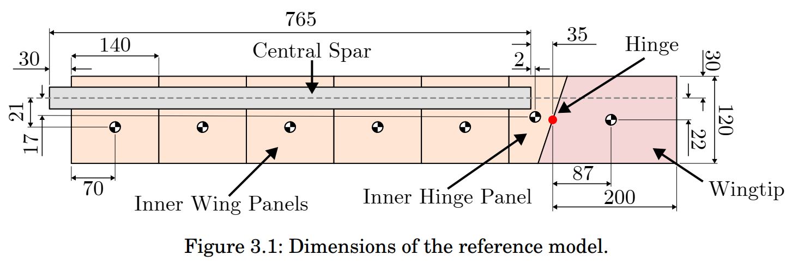

```@meta
EditURL = "../../../test/examples/HealyBaselineFFWTfreeFlutterAoARangeURange.jl"
```

# Flutter analysis of a wing with flared folding wingtip (FFWT)
This example illustrates how to set up a flutter analysis for a wing featuring a flared folding wingtip (FFWT). The influence of the root pitch angle on the behavior of this wing model was studied numerically in [Healy's PhD Thesis](https://research-information.bris.ac.uk/ws/portalfiles/portal/388426634/Final_Copy_2024_01_23_Healy_F_PhD_Redacted.pdf).



*Top view of baseline wing model featuring a FFWT* by [Healy et al.](https://doi.org/10.2514/6.2023-0376)

!!! tip
    The code for this example is available [here](https://github.com/luizpancini/AeroBeams.jl/blob/main/test/examples/HealyBaselineFFWTfreeFlutterAoARangeURange.jl).

### Problem setup
Let's begin by setting the variables of our problem. In this example we will analyze the coasting angle and stability of the free FFWT under several root pitch angles. The flare angle of the wingtip is of 15 degrees, and the airspeed is varied. The influence of three-dimensional aerodynamic effects is investigated through the tip loss factor, for which two values are assumed (one leading to some tip loss, and another leading to no tip loss). The hinge is assumed as a universal joint (allowing movement about the three axes), but the restriction of the in-plane bending DOF is modeled through a stiff spring with value `kIPBendingHinge`. Only the flutter mechanism arising from the interaction of the first two modes (the wingtip flapping mode and the first OOP bending mode) are analyzed.

````@example HealyBaselineFFWTfreeFlutterAoARangeURange
using AeroBeams, DelimitedFiles

# Hinge configuration
hingeConfiguration = "free"

# Tip loss factor range
τRange = [12,Inf64]

# Pitch angle range [rad]
θRange = π/180*[0,3,6]

# Airspeed range [m/s]
URange = collect(1:0.5:40)

# Flare angle
Λ = 15*π/180

# Gravity
g = 9.80665

# Stiffness of the spring around the hinge for in-plane bending
kIPBendingHinge = 1e1

# Discretization
nElementsInner = 16
nElementsFFWT = 4

# Tip loss TF
withTipCorrection = true

# System solver
σ0 = 1
maxIter = 200
relTol = 1e-5
ΔλRelaxFactor = 1
NR = create_NewtonRaphson(displayStatus=false,initialLoadFactor=σ0,maximumIterations=maxIter,relativeTolerance=relTol,ΔλRelaxFactor=ΔλRelaxFactor)

# Number of modes
nModes = 2

# Initialize outputs
untrackedFreqs = [fill(NaN64, nModes) for τ in 1:length(τRange), Λ in 1:length(θRange), U in 1:length(URange)]
untrackedDamps = [fill(NaN64, nModes) for τ in 1:length(τRange), Λ in 1:length(θRange), U in 1:length(URange)]
untrackedEigenvectors = [fill(NaN64+im*NaN64, nModes, nModes) for τ in 1:length(τRange), Λ in 1:length(θRange), U in 1:length(URange)]
freqs = [fill(NaN64, nModes) for τ in 1:length(τRange), Λ in 1:length(θRange), U in 1:length(URange)]
damps = [fill(NaN64, nModes) for τ in 1:length(τRange), Λ in 1:length(θRange), U in 1:length(URange)]
modeFrequencies = [fill(NaN64, nModes) for τ in 1:length(τRange), Λ in 1:length(θRange), U in 1:length(URange)]
modeDampings = [fill(NaN64, nModes) for τ in 1:length(τRange), Λ in 1:length(θRange), U in 1:length(URange)]
modeDampingRatios = [fill(NaN64, nModes) for τ in 1:length(τRange), Λ in 1:length(θRange), U in 1:length(URange)]
ϕHinge = [NaN64 for τ in 1:length(τRange), Λ in 1:length(θRange), U in 1:length(URange)]
problem = Array{EigenProblem}(undef,length(τRange),length(θRange),length(URange))
nothing #hide
````

### Solving the problem
In the following loops, we create new model instances for each combination of tip loss decay factor, pitch angle and airspeed, create and solve the eigen problem, and then extract the coasting angle of the FFWT (`ϕHinge`) and the frequencies, dampings and eigenvectors. The model creation process is streamlined with the function [`create_HealyBaselineFFWT`](@ref create_HealyBaselineFFWT), taking the appropriate inputs. For nonzero pitch angles, the algorithm fails to converge at low airspeed values.

````@example HealyBaselineFFWTfreeFlutterAoARangeURange
using Suppressor #hide
# Sweep tip loss factor
for (i,τ) in enumerate(τRange)
    # Sweep pitch angle
    for (j,θ) in enumerate(θRange)
        # Sweep airspeed
        for (k,U) in enumerate(URange)
            # Display progress
            # Update model
            model = create_HealyBaselineFFWT(hingeConfiguration=hingeConfiguration,flareAngle=Λ,airspeed=U,pitchAngle=θ,withTipCorrection=withTipCorrection,tipLossDecayFactor=τ,g=g,kIPBendingHinge=kIPBendingHinge,nElementsInner=nElementsInner,nElementsFFWT=nElementsFFWT)
            # Create and solve problem
            problem[i,j,k] = create_EigenProblem(model=model,nModes=nModes,systemSolver=NR,frequencyFilterLimits=[1e-2*U,Inf])
        @suppress begin #hide
                solve!(problem[i,j,k])
        end #hide
            # Get outputs, if converged
            if problem[i,j,k].systemSolver.convergedFinalSolution
                # Frequencies and dampings
                untrackedFreqs[i,j,k] = problem[i,j,k].frequenciesOscillatory
                untrackedDamps[i,j,k] = round_off!(problem[i,j,k].dampingsOscillatory,1e-8)
                untrackedEigenvectors[i,j,k] = problem[i,j,k].eigenvectorsOscillatoryCplx
                # Hinge fold angle
                ϕHinge[i,j,k] = -problem[i,j,k].model.hingeAxisConstraints[1].ϕ*180/π
            end
        end
        # Apply mode tracking
        freqs[i,j,:],damps[i,j,:],_ = mode_tracking(URange,untrackedFreqs[i,j,:],untrackedDamps[i,j,:],untrackedEigenvectors[i,j,:])
        # Separate frequencies and damping ratios by mode
        for mode in 1:nModes
            modeFrequencies[i,j,mode] = [freqs[i,j,k][mode] for k in eachindex(URange)]
            modeDampings[i,j,mode] = [damps[i,j,k][mode] for k in eachindex(URange)]
            modeDampingRatios[i,j,mode] = modeDampings[i,j,mode]./modeFrequencies[i,j,mode]
        end
    end
end
nothing #hide
````

### Post-processing
The post-processing begins by loading the reference data.

````@example HealyBaselineFFWTfreeFlutterAoARangeURange
# Load reference data
fold_ST = readdlm(pkgdir(AeroBeams)*"/test/referenceData/HealyBaselineFFWTfreeFlutterAoARangeURange/fold_ST.txt")
fold_VLM = readdlm(pkgdir(AeroBeams)*"/test/referenceData/HealyBaselineFFWTfreeFlutterAoARangeURange/fold_VLM.txt")
freq1_ST = readdlm(pkgdir(AeroBeams)*"/test/referenceData/HealyBaselineFFWTfreeFlutterAoARangeURange/freq1_ST.txt")
freq2_ST = readdlm(pkgdir(AeroBeams)*"/test/referenceData/HealyBaselineFFWTfreeFlutterAoARangeURange/freq2_ST.txt")
freq1_VLM = readdlm(pkgdir(AeroBeams)*"/test/referenceData/HealyBaselineFFWTfreeFlutterAoARangeURange/freq1_VLM.txt")
freq2_VLM = readdlm(pkgdir(AeroBeams)*"/test/referenceData/HealyBaselineFFWTfreeFlutterAoARangeURange/freq2_VLM.txt")
damp1_ST = readdlm(pkgdir(AeroBeams)*"/test/referenceData/HealyBaselineFFWTfreeFlutterAoARangeURange/damp1_ST.txt")
damp2_ST = readdlm(pkgdir(AeroBeams)*"/test/referenceData/HealyBaselineFFWTfreeFlutterAoARangeURange/damp2_ST.txt")
damp1_VLM = readdlm(pkgdir(AeroBeams)*"/test/referenceData/HealyBaselineFFWTfreeFlutterAoARangeURange/damp1_VLM.txt")
damp2_VLM = readdlm(pkgdir(AeroBeams)*"/test/referenceData/HealyBaselineFFWTfreeFlutterAoARangeURange/damp2_VLM.txt")

# Adjust data for plots by padding matrices with NaN
matrices = Dict(
    :fold_ST => fold_ST,
    :fold_VLM => fold_VLM,
    :freq1_ST => freq1_ST,
    :freq2_ST => freq2_ST,
    :freq1_VLM => freq1_VLM,
    :freq2_VLM => freq2_VLM,
    :damp1_ST => damp1_ST,
    :damp2_ST => damp2_ST,
    :damp1_VLM => damp1_VLM,
    :damp2_VLM => damp2_VLM,
)
for key in keys(matrices)
    matrices[key] .= [x == "" ? NaN64 : x for x in matrices[key]]
end
fold_ST = matrices[:fold_ST]
fold_VLM = matrices[:fold_VLM]
freq1_ST = matrices[:freq1_ST]
freq2_ST = matrices[:freq2_ST]
freq1_VLM = matrices[:freq1_VLM]
freq2_VLM = matrices[:freq2_VLM]
damp1_ST = matrices[:damp1_ST]
damp2_ST = matrices[:damp2_ST]
damp1_VLM = matrices[:damp1_VLM]
damp2_VLM = matrices[:damp2_VLM]

nothing #hide
````

We can now plot the coasting (fold) angle of the FFWT and the evolution of the frequencies and dampings of the modes of vibration as functions of airspeed for each root pitch angle. The following reference results were taken from Fig. 3.32 of [Healy's PhD Thesis](https://research-information.bris.ac.uk/ws/portalfiles/portal/388426634/Final_Copy_2024_01_23_Healy_F_PhD_Redacted.pdf). Healy's numerical method is composed of a Rayleigh-Ritz structural model coupled to a vortex-lattice method (VLM) or strip-theory (ST) method for aerodynamics, with the flared folding wingtip being modeled as a point inertia connected to the inner wing via a hinge. The behavior of the fold angle is accurately captured, and the correlation of the frequencies and dampings with the reference data is fair, although AeroBeams predicts smaller dampings, and consequently, sooner flutter onset.

````@example HealyBaselineFFWTfreeFlutterAoARangeURange
using Plots, ColorSchemes
gr()
ENV["GKSwstype"] = "100" #hide
colors = cgrad(:rainbow, length(θRange), categorical=true)
lw = 2

# Fold angle - without tip loss
plt1 = plot(xlabel="Airspeed [m/s]", ylabel="Fold angle [deg]", xlims=[0,40], ylims=[-90,30], yticks=-90:30:30, title="Without tip loss")
plot!([NaN],[NaN], lc=:black, ls=:dash, lw=lw, label="Healy (2023) - ST")
plot!([NaN],[NaN], lc=:black, ls=:solid, lw=lw, label="AeroBeams")
for (j,θ) in enumerate(θRange)
    plot!(fold_ST[2*j-1,:],fold_ST[2*j,:], c=colors[j], ls=:dash, lw=lw, label=false)
    plot!(URange, ϕHinge[2,j,:], c=colors[j], lw=lw, label="\$\\theta = $(round(Int,θ*180/π)) \\degree\$")
end
savefig("HealyBaselineFFWTfreeFlutterAoARangeURange_fold_tipLoss0.svg")

# Fold angle - with tip loss
plt2 = plot(xlabel="Airspeed [m/s]", ylabel="Fold angle [deg]", xlims=[0,40], ylims=[-90,30], yticks=-90:30:30, title="With tip loss")
plot!([NaN],[NaN], lc=:black, ls=:dash, lw=lw, label="Healy (2023) - VLM")
plot!([NaN],[NaN], lc=:black, ls=:solid, lw=lw, label="AeroBeams")
for (j,θ) in enumerate(θRange)
    plot!(fold_VLM[2*j-1,:],fold_VLM[2*j,:], c=colors[j], ls=:dash, lw=lw, label=false)
    plot!(URange, ϕHinge[1,j,:], c=colors[j], lw=lw, label="\$\\theta = $(round(Int,θ*180/π)) \\degree\$")
end
savefig("HealyBaselineFFWTfreeFlutterAoARangeURange_fold_tipLoss1.svg")

# V-g-f - without tip loss
range = 1:45
plt31 = plot(ylabel="Frequency [Hz]", xlims=[0,30], ylims=[0,5], title="Without tip loss", legend=:bottomright)
plt32 = plot(xlabel="Airspeed [m/s]", ylabel="Damping Ratio", xlims=[0,30], ylims=[-0.5,0.25], legend=:bottomleft)
plot!(plt31, [NaN],[NaN], lc=:black, ls=:dash, lw=lw, label="Healy (2023) - ST")
plot!(plt31, [NaN],[NaN], lc=:black, ls=:solid, lw=lw, label="AeroBeams")
for (j,θ) in enumerate(θRange)
    for mode in 1:nModes
        plot!(plt31, URange[range], modeFrequencies[2,j,mode][range]/(2*π), c=colors[j], lw=lw, label=false)
        plot!(plt32, URange[range], modeDampingRatios[2,j,mode][range], c=colors[j], lw=lw, label=false)
    end
    plot!(plt31, freq1_ST[2*j-1,:], freq1_ST[2*j,:], c=colors[j], ls=:dash, lw=lw, label=false)
    plot!(plt31, freq2_ST[2*j-1,:], freq2_ST[2*j,:], c=colors[j], ls=:dash, lw=lw, label=false)
    plot!(plt32, damp1_ST[2*j-1,:], damp1_ST[2*j,:], c=colors[j], ls=:dash, lw=lw, label=false)
    plot!(plt32, damp2_ST[2*j-1,:], damp2_ST[2*j,:], c=colors[j], ls=:dash, lw=lw, label=false)
    plot!(plt32,[NaN],[NaN], c=colors[j], ls=:solid, lw=lw, label="\$\\theta = $(round(Int,θ*180/π)) \\degree\$")
end
plt3 = plot(plt31,plt32, layout=(2,1))
savefig("HealyBaselineFFWTfreeFlutterAoARangeURange_Vgf_tipLoss0.svg")

# V-g-f - with tip loss
plt41 = plot(ylabel="Frequency [Hz]", xlims=[0,30], ylims=[0,5], title="With tip loss", legend=:bottomright)
plt42 = plot(xlabel="Airspeed [m/s]", ylabel="Damping Ratio", xlims=[0,30], ylims=[-0.5,0.25], legend=:bottomleft)
plot!(plt41, [NaN],[NaN], lc=:black, ls=:dash, lw=lw, label="Healy (2023) - VLM")
plot!(plt41, [NaN],[NaN], lc=:black, ls=:solid, lw=lw, label="AeroBeams")
for (j,θ) in enumerate(θRange)
    for mode in 1:nModes
        plot!(plt41, URange, modeFrequencies[1,j,mode]/(2*π), c=colors[j], lw=lw, label=false)
        plot!(plt42, URange, modeDampingRatios[1,j,mode], c=colors[j], lw=lw, label=false)
    end
    plot!(plt41, freq1_VLM[2*j-1,:], freq1_VLM[2*j,:], c=colors[j], ls=:dash, lw=lw, label=false)
    plot!(plt41, freq2_VLM[2*j-1,:], freq2_VLM[2*j,:], c=colors[j], ls=:dash, lw=lw, label=false)
    plot!(plt42, damp1_VLM[2*j-1,:], damp1_VLM[2*j,:], c=colors[j], ls=:dash, lw=lw, label=false)
    plot!(plt42, damp2_VLM[2*j-1,:], damp2_VLM[2*j,:], c=colors[j], ls=:dash, lw=lw, label=false)
    plot!(plt42,[NaN],[NaN], c=colors[j], ls=:solid, lw=lw, label="\$\\theta = $(round(Int,θ*180/π)) \\degree\$")
end
plt4 = plot(plt41,plt42, layout=(2,1))
savefig("HealyBaselineFFWTfreeFlutterAoARangeURange_Vgf_tipLoss1.svg")

nothing #hide
````


---

*This page was generated using [Literate.jl](https://github.com/fredrikekre/Literate.jl).*

