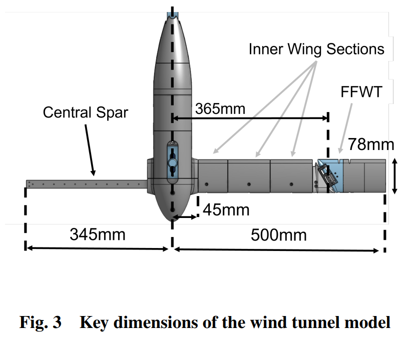
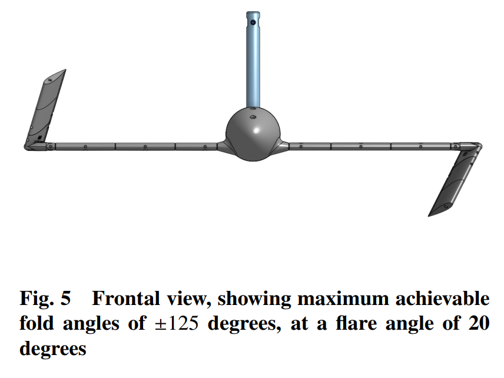

```@meta
EditURL = "../../../test/examples/HealyFFWTsteadyTwistRangeAoARangeSideslipRangeCoast.jl"
```

# Steady aeroelastic analysis of a wing with flared folding wingtip (FFWT)
This example illustrates how to set up a steady aeroelastic analysis for a wing featuring a flared folding wingtip (FFWT). The influence of the sideslip angle on the behavior of this wing model was studied numerically and experimentally by [Healy et al.](https://doi.org/10.2514/6.2023-0376), and more details can be found in [Healy's PhD Thesis](https://research-information.bris.ac.uk/ws/portalfiles/portal/388426634/Final_Copy_2024_01_23_Healy_F_PhD_Redacted.pdf).



*Top view of aircraft model featuring a FFWT* by [Healy et al.](https://doi.org/10.2514/6.2023-0376)



*Front view of aircraft model featuring a FFWT* by [Healy et al.](https://doi.org/10.2514/6.2023-0376)

!!! tip
    The code for this example is available [here](https://github.com/luizpancini/AeroBeams.jl/blob/main/test/examples/HealyFFWTsteadyTwistRangeAoARangeSideslipRangeCoast.jl).

### Problem setup
Let's begin by setting the variables of our problem. In this example we will analyze the coasting angle of the FFWT under several combinations of wingtip twist, root pitch angle and sideslip angle, which are defined by the arrays `φRange`, `θRange` and `βRange`, respectively. The flare angle of the wingtip is of 20 degrees, and the airspeed is 22 m/s. A very soft rotational spring is introduced here to avoid the singularity associated with the hinge, through the variable `kSpring`. We also assume a fixed spanwise lift distribution through the parameter `tipLossDecayFactor`, in order to model three-dimensional aerodynamic effects.

````@example HealyFFWTsteadyTwistRangeAoARangeSideslipRangeCoast
using AeroBeams, DelimitedFiles

# Wingtip twist angle range
φRange = π/180*[-6,0,9]

# Root pitch angle range
θRange = π/180*vcat(-3:3:12)

# Sideslip angle range
βRange = π/180*vcat(-10:1:30)

# Flare angle [rad]
Λ = 20*π/180

# Airspeed
U = 22

# Spring stiffness
kSpring = 1e-4

# Discretization
nElementsInner = 15
nElementsFFWT = 5

# Tip loss options (the value of tipLossDecayFactor is assumed to match the experimental results, since it strongly influences the solution, especially at lower airspeeds)
withTipCorrection = true
tipLossDecayFactor = 10

# Initialize model
HealyFFWTsteadyTwistRangeAoARangeSideslipRangeCoast = create_HealyFFWT(flareAngle=0,kSpring=kSpring,pitchAngle=0,withTipCorrection=withTipCorrection,tipLossDecayFactor=tipLossDecayFactor,nElementsInner=nElementsInner,nElementsFFWT=nElementsFFWT)

# System solver
σ0 = 1
maxIter = 200
relTol = 1e-6
ΔλRelaxFactor = 1/2
NR = create_NewtonRaphson(displayStatus=false,initialLoadFactor=σ0,maximumIterations=maxIter,relativeTolerance=relTol,ΔλRelaxFactor=ΔλRelaxFactor)

# Initialize outputs
ϕHinge = Array{Float64}(undef,length(φRange),length(θRange),length(βRange))
problem = Array{SteadyProblem}(undef,length(φRange),length(θRange),length(βRange))
nothing #hide
````

### Solving the problem
In the following loops, we create new model instances for each combination of wingtip twist, pitch angle and sideslip angle, create and solve the steady problem, and then extract the coasting angle of the FFWT (`ϕHinge`). The model creation process is streamlined with the function [`create_HealyFFWT`](@ref create_HealyFFWT), taking the appropriate inputs. We run the simulations up to the maximum sideslip angle for which convergence is achieved.

````@example HealyFFWTsteadyTwistRangeAoARangeSideslipRangeCoast
using Suppressor #hide
# Loop wingtip twist angle
for (i,φ) in enumerate(φRange)
    # Loop root pitch angle
    for (j,θ) in enumerate(θRange)
        # Loop sideslip angle
        for (k,β) in enumerate(βRange)
            # Update model
            model = create_HealyFFWT(flareAngle=Λ,kSpring=kSpring,airspeed=U,pitchAngle=θ,wingtipTwist=φ,withTipCorrection=withTipCorrection,tipLossDecayFactor=tipLossDecayFactor,nElementsInner=nElementsInner,nElementsFFWT=nElementsFFWT,flightDirection=[sin(β);cos(β);0])
            # Set initial guess solution as the one from previous sideslip angle
            x0 = (k>1 && problem[i,j,k-1].systemSolver.convergedFinalSolution) ? problem[i,j,k-1].x : zeros(0)
            # Create and solve problem
            problem[i,j,k] = create_SteadyProblem(model=model,systemSolver=NR,x0=x0)
           @suppress begin #hide
                solve!(problem[i,j,k])
           end #hide
            converged = problem[i,j,k].systemSolver.convergedFinalSolution
            # Get outputs, if converged
            ϕHinge[i,j,k] = converged ? problem[i,j,k].model.hingeAxisConstraints[1].ϕ*180/π : NaN
            # Skip remaining sideslip angles, if unconverged
            if !converged
                ϕHinge[i,j,k+1:end] .= NaN
                break
            end
        end
    end
end
nothing #hide
````

### Post-processing
The post-processing begins by loading the reference data.

````@example HealyFFWTsteadyTwistRangeAoARangeSideslipRangeCoast
# Load reference data
phim6_aoam3_exp = readdlm(pkgdir(AeroBeams)*"/test/referenceData/HealyFFWTsteadyTwistRangeAoARangeSideslipRangeCoast/phim6_aoam3_exp.txt")
phim6_aoam3_num = readdlm(pkgdir(AeroBeams)*"/test/referenceData/HealyFFWTsteadyTwistRangeAoARangeSideslipRangeCoast/phim6_aoam3_num.txt")
phim6_aoa0_exp = readdlm(pkgdir(AeroBeams)*"/test/referenceData/HealyFFWTsteadyTwistRangeAoARangeSideslipRangeCoast/phim6_aoa0_exp.txt")
phim6_aoa0_num = readdlm(pkgdir(AeroBeams)*"/test/referenceData/HealyFFWTsteadyTwistRangeAoARangeSideslipRangeCoast/phim6_aoa0_num.txt")
phim6_aoa3_exp = readdlm(pkgdir(AeroBeams)*"/test/referenceData/HealyFFWTsteadyTwistRangeAoARangeSideslipRangeCoast/phim6_aoa3_exp.txt")
phim6_aoa3_num = readdlm(pkgdir(AeroBeams)*"/test/referenceData/HealyFFWTsteadyTwistRangeAoARangeSideslipRangeCoast/phim6_aoa3_num.txt")
phim6_aoa6_exp = readdlm(pkgdir(AeroBeams)*"/test/referenceData/HealyFFWTsteadyTwistRangeAoARangeSideslipRangeCoast/phim6_aoa6_exp.txt")
phim6_aoa6_num = readdlm(pkgdir(AeroBeams)*"/test/referenceData/HealyFFWTsteadyTwistRangeAoARangeSideslipRangeCoast/phim6_aoa6_num.txt")
phim6_aoa9_exp = readdlm(pkgdir(AeroBeams)*"/test/referenceData/HealyFFWTsteadyTwistRangeAoARangeSideslipRangeCoast/phim6_aoa9_exp.txt")
phim6_aoa9_num = readdlm(pkgdir(AeroBeams)*"/test/referenceData/HealyFFWTsteadyTwistRangeAoARangeSideslipRangeCoast/phim6_aoa9_num.txt")
phim6_aoa12_exp = readdlm(pkgdir(AeroBeams)*"/test/referenceData/HealyFFWTsteadyTwistRangeAoARangeSideslipRangeCoast/phim6_aoa12_exp.txt")
phim6_aoa12_num = readdlm(pkgdir(AeroBeams)*"/test/referenceData/HealyFFWTsteadyTwistRangeAoARangeSideslipRangeCoast/phim6_aoa12_num.txt")

phi0_aoam3_exp = readdlm(pkgdir(AeroBeams)*"/test/referenceData/HealyFFWTsteadyTwistRangeAoARangeSideslipRangeCoast/phi0_aoam3_exp.txt")
phi0_aoam3_num = readdlm(pkgdir(AeroBeams)*"/test/referenceData/HealyFFWTsteadyTwistRangeAoARangeSideslipRangeCoast/phi0_aoam3_num.txt")
phi0_aoa0_exp = readdlm(pkgdir(AeroBeams)*"/test/referenceData/HealyFFWTsteadyTwistRangeAoARangeSideslipRangeCoast/phi0_aoa0_exp.txt")
phi0_aoa0_num = readdlm(pkgdir(AeroBeams)*"/test/referenceData/HealyFFWTsteadyTwistRangeAoARangeSideslipRangeCoast/phi0_aoa0_num.txt")
phi0_aoa3_exp = readdlm(pkgdir(AeroBeams)*"/test/referenceData/HealyFFWTsteadyTwistRangeAoARangeSideslipRangeCoast/phi0_aoa3_exp.txt")
phi0_aoa3_num = readdlm(pkgdir(AeroBeams)*"/test/referenceData/HealyFFWTsteadyTwistRangeAoARangeSideslipRangeCoast/phi0_aoa3_num.txt")
phi0_aoa6_exp = readdlm(pkgdir(AeroBeams)*"/test/referenceData/HealyFFWTsteadyTwistRangeAoARangeSideslipRangeCoast/phi0_aoa6_exp.txt")
phi0_aoa6_num = readdlm(pkgdir(AeroBeams)*"/test/referenceData/HealyFFWTsteadyTwistRangeAoARangeSideslipRangeCoast/phi0_aoa6_num.txt")
phi0_aoa9_exp = readdlm(pkgdir(AeroBeams)*"/test/referenceData/HealyFFWTsteadyTwistRangeAoARangeSideslipRangeCoast/phi0_aoa9_exp.txt")
phi0_aoa9_num = readdlm(pkgdir(AeroBeams)*"/test/referenceData/HealyFFWTsteadyTwistRangeAoARangeSideslipRangeCoast/phi0_aoa9_num.txt")
phi0_aoa12_exp = readdlm(pkgdir(AeroBeams)*"/test/referenceData/HealyFFWTsteadyTwistRangeAoARangeSideslipRangeCoast/phi0_aoa12_exp.txt")
phi0_aoa12_num = readdlm(pkgdir(AeroBeams)*"/test/referenceData/HealyFFWTsteadyTwistRangeAoARangeSideslipRangeCoast/phi0_aoa12_num.txt")

phi9_aoam3_exp = readdlm(pkgdir(AeroBeams)*"/test/referenceData/HealyFFWTsteadyTwistRangeAoARangeSideslipRangeCoast/phi9_aoam3_exp.txt")
phi9_aoam3_num = readdlm(pkgdir(AeroBeams)*"/test/referenceData/HealyFFWTsteadyTwistRangeAoARangeSideslipRangeCoast/phi9_aoam3_num.txt")
phi9_aoa0_exp = readdlm(pkgdir(AeroBeams)*"/test/referenceData/HealyFFWTsteadyTwistRangeAoARangeSideslipRangeCoast/phi9_aoa0_exp.txt")
phi9_aoa0_num = readdlm(pkgdir(AeroBeams)*"/test/referenceData/HealyFFWTsteadyTwistRangeAoARangeSideslipRangeCoast/phi9_aoa0_num.txt")
phi9_aoa3_exp = readdlm(pkgdir(AeroBeams)*"/test/referenceData/HealyFFWTsteadyTwistRangeAoARangeSideslipRangeCoast/phi9_aoa3_exp.txt")
phi9_aoa3_num = readdlm(pkgdir(AeroBeams)*"/test/referenceData/HealyFFWTsteadyTwistRangeAoARangeSideslipRangeCoast/phi9_aoa3_num.txt")
phi9_aoa6_exp = readdlm(pkgdir(AeroBeams)*"/test/referenceData/HealyFFWTsteadyTwistRangeAoARangeSideslipRangeCoast/phi9_aoa6_exp.txt")
phi9_aoa6_num = readdlm(pkgdir(AeroBeams)*"/test/referenceData/HealyFFWTsteadyTwistRangeAoARangeSideslipRangeCoast/phi9_aoa6_num.txt")
phi9_aoa9_exp = readdlm(pkgdir(AeroBeams)*"/test/referenceData/HealyFFWTsteadyTwistRangeAoARangeSideslipRangeCoast/phi9_aoa9_exp.txt")
phi9_aoa9_num = readdlm(pkgdir(AeroBeams)*"/test/referenceData/HealyFFWTsteadyTwistRangeAoARangeSideslipRangeCoast/phi9_aoa9_num.txt")
phi9_aoa12_exp = readdlm(pkgdir(AeroBeams)*"/test/referenceData/HealyFFWTsteadyTwistRangeAoARangeSideslipRangeCoast/phi9_aoa12_exp.txt")
phi9_aoa12_num = readdlm(pkgdir(AeroBeams)*"/test/referenceData/HealyFFWTsteadyTwistRangeAoARangeSideslipRangeCoast/phi9_aoa12_num.txt")

nothing #hide
````

We can now plot the coasting angle of the FFWT as a function of sideslip angle for each of the root pitch and wingtip twist angles. The following reference results (both numerical and experimental) were taken from Fig. 7.34 of [Healy's PhD Thesis](https://research-information.bris.ac.uk/ws/portalfiles/portal/388426634/Final_Copy_2024_01_23_Healy_F_PhD_Redacted.pdf). Healy's numerical method is composed of a Rayleigh-Ritz structural model coupled to a VLM for aerodynamics, with the flared folding wingtip being modeled as a point inertia connected to the inner wing via a hinge. For the most part, the correlation of AeroBeams' results with the reference data is good, especially for the case of zero wingtip twist. This twist profile is very agressively introduced at the very tip of the wing, and similar convergence problems for these cases were also reported by [Jan et al.](https://www.researchgate.net/profile/Romain-Jan/publication/377725388_Experimental_validation_of_an_aeroelasticity_framework_ASWING_Part_IV_Aeroelasticity/links/6692718a3e0edb1e0fe110c7/Experimental-validation-of-an-aeroelasticity-framework-ASWING-Part-IV-Aeroelasticity.pdf) with [ASWING](https://web.mit.edu/drela/Public/web/aswing/). Also note that the wingtip is limited to a fold angle of $\pm125^\degree$, a detail that is not implemented yet in AeroBeams.

````@example HealyFFWTsteadyTwistRangeAoARangeSideslipRangeCoast
using Plots, ColorSchemes
gr()
ENV["GKSwstype"] = "100" #hide
colors = cgrad(:rainbow, length(θRange), categorical=true)
lw = 2
ms = 6
msw = 0
figureNames = ["HealyFFWTsteadySideslipRangeAoARangeCoast_phim6.svg" "HealyFFWTsteadySideslipRangeAoARangeCoast_phi0.svg" "HealyFFWTsteadySideslipRangeAoARangeCoast_phi9.svg"]
nothing #hide

# Coast angle vs sideslip angle for each AoA, for several wingtip twist angles
for (i,φ) in enumerate(φRange)
    if i==1
        aoam3_exp = phim6_aoam3_exp
        aoam3_num = phim6_aoam3_num
        aoa0_exp = phim6_aoa0_exp
        aoa0_num = phim6_aoa0_num
        aoa3_exp = phim6_aoa3_exp
        aoa3_num = phim6_aoa3_num
        aoa6_exp = phim6_aoa6_exp
        aoa6_num = phim6_aoa6_num
        aoa9_exp = phim6_aoa9_exp
        aoa9_num = phim6_aoa9_num
        aoa12_exp = phim6_aoa12_exp
        aoa12_num = phim6_aoa12_num
    elseif i==2
        aoam3_exp = phi0_aoam3_exp
        aoam3_num = phi0_aoam3_num
        aoa0_exp = phi0_aoa0_exp
        aoa0_num = phi0_aoa0_num
        aoa3_exp = phi0_aoa3_exp
        aoa3_num = phi0_aoa3_num
        aoa6_exp = phi0_aoa6_exp
        aoa6_num = phi0_aoa6_num
        aoa9_exp = phi0_aoa9_exp
        aoa9_num = phi0_aoa9_num
        aoa12_exp = phi0_aoa12_exp
        aoa12_num = phi0_aoa12_num
    else
        aoam3_exp = phi9_aoam3_exp
        aoam3_num = phi9_aoam3_num
        aoa0_exp = phi9_aoa0_exp
        aoa0_num = phi9_aoa0_num
        aoa3_exp = phi9_aoa3_exp
        aoa3_num = phi9_aoa3_num
        aoa6_exp = phi9_aoa6_exp
        aoa6_num = phi9_aoa6_num
        aoa9_exp = phi9_aoa9_exp
        aoa9_num = phi9_aoa9_num
        aoa12_exp = phi9_aoa12_exp
        aoa12_num = phi9_aoa12_num
    end
    plt = plot(xlabel="Sideslip angle [deg]", ylabel="Coast angle [deg]", title="Wingtip twist = \$ $(round(Int,φ*180/π)) \\degree\$", xlims=[-10,30], ylims=[-150,150], yticks=-150:30:150)
    if i==1
        plot!(legendfontsize=7, legend=:topleft)
    else
        plot!(legend=false)
    end
    scatter!([NaN],[NaN], mc=:black, ms=ms, msw=msw, label="Healy (2023) - Exp.")
    plot!([NaN],[NaN], lc=:black, ls=:dash, lw=lw, label="Healy (2023) - Num.")
    plot!([NaN],[NaN], lc=:black, ls=:solid, lw=lw, label="AeroBeams")
    for (j,θ) in enumerate(θRange)
        plot!(βRange*180/π, -ϕHinge[i,j,:], lw=lw, ls=:solid, c=colors[j], label="\$\\theta = $(round(Int,θ*180/π)) \\degree\$")
        if j==1
            plot!(aoam3_num[1,:], aoam3_num[2,:], lw=lw, ls=:dash, c=colors[j], label=false)
            scatter!(aoam3_exp[1,:], aoam3_exp[2,:], ms=ms, msw=msw, c=colors[j], label=false)
        elseif j==2
            plot!(aoa0_num[1,:], aoa0_num[2,:], lw=lw, ls=:dash, c=colors[j], label=false)
            scatter!(aoa0_exp[1,:], aoa0_exp[2,:], ms=ms, msw=msw, c=colors[j], label=false)
        elseif j==3
            plot!(aoa3_num[1,:], aoa3_num[2,:], lw=lw, ls=:dash, c=colors[j], label=false)
            scatter!(aoa3_exp[1,:], aoa3_exp[2,:], ms=ms, msw=msw, c=colors[j], label=false)
        elseif j==4
            plot!(aoa6_num[1,:], aoa6_num[2,:], lw=lw, ls=:dash, c=colors[j], label=false)
            scatter!(aoa6_exp[1,:], aoa6_exp[2,:], ms=ms, msw=msw, c=colors[j], label=false)
        elseif j==5
            plot!(aoa9_num[1,:], aoa9_num[2,:], lw=lw, ls=:dash, c=colors[j], label=false)
            scatter!(aoa9_exp[1,:], aoa9_exp[2,:], ms=ms, msw=msw, c=colors[j], label=false)
        else
            plot!(aoa12_num[1,:], aoa12_num[2,:], lw=lw, ls=:dash, c=colors[j], label=false)
            scatter!(aoa12_exp[1,:], aoa12_exp[2,:], ms=ms, msw=msw, c=colors[j], label=false)
        end
    end
    savefig(figureNames[i]) #hide
end
nothing #hide
````


---

*This page was generated using [Literate.jl](https://github.com/fredrikekre/Literate.jl).*

