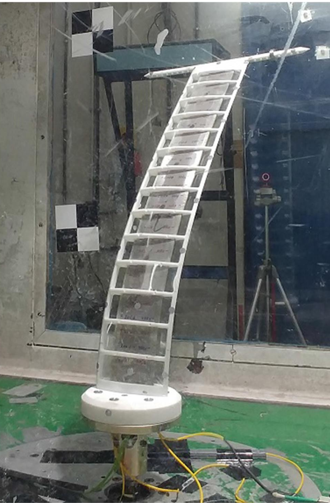

```@meta
EditURL = "../../../test/examples/PazyWingPitchRange.jl"
```

# Steady aeroelastic analysis of the Pazy wing
This example illustrates how to set up a steady aeroelastic analysis, using the Technion's Pazy wing benchmark. The sectional properties of the wing's spar and the aerodynamic tip loss function were defined by [Riso and Cesnik](https://doi.org/10.2514/6.2022-2313). The data is publicly available at [https://github.com/UM-A2SRL/AePW3-LDWG](https://github.com/UM-A2SRL/AePW3-LDWG).



*Pazy wing in the wind tunnel* by [Avin et al.](https://doi.org/10.2514/1.J060621)

!!! tip
    The code for this example is available [here](https://github.com/luizpancini/AeroBeams.jl/blob/main/test/examples/PazyWingPitchRange.jl).

### Problem setup
Let's begin by setting the variables of our problem. In this example we will analyze the displacements and twist of the clamped wing under several combinations of root pitch angle and airspeed, which are defined by the arrays `θRange` and `URange`. The wing was tested with a balance mass of 0.01 kg attached to its tip store, at a position of 0.01 m behind the trailing-edge. Notice that we bring into scope some fixed geometrical and discretization properties of the wing's beam through the function [`geometrical_properties_Pazy`](@ref geometrical_properties_Pazy).

````@example PazyWingPitchRange
using AeroBeams, DelimitedFiles

# Aerodynamic solver
aeroSolver = Indicial()

# Derivation method
derivationMethod = AD()

# Flag for upright position
upright = true

# Gravity
g = -9.80665

# Fixed geometrical and discretization properties
nElem,L,chord,normSparPos = geometrical_properties_Pazy()

# Tip mass (0.01 kg, 0.01 m behind the trailing-edge)
tipMass = 0.01
ξtipMass = [0; -chord*(1-normSparPos)-0.01; 0]

# Root angle (in degrees) and airspeed ranges
θRange = [3; 5; 7]
URange = collect(0:1:60)

# Initialize outputs
tip_OOP = Array{Float64}(undef,length(θRange),length(URange))
tip_IP = Array{Float64}(undef,length(θRange),length(URange))
tip_twist = Array{Float64}(undef,length(θRange),length(URange))
tip_AoA = Array{Float64}(undef,length(θRange),length(URange))
nothing #hide
````

### Solving the problem
In the following loops, we create new model instances with the combination of pitch angle and airspeed, create and solve the steady problem, and then extract the outputs of interest. The model creation process is streamlined with the function [`create_Pazy`](@ref create_Pazy), taking the appropriate inputs. Notice that the twist angle is computed as the arcsine of the difference in "height" between the leading edge and trailing edge of the wingtip (throught the rotation of the local basis vector pointing in the x2-direction).

````@example PazyWingPitchRange
# Sweep root angle
for (i,θ) in enumerate(θRange)
    # Sweep airspeed
    for (j,U) in enumerate(URange)
        # Update model
        PazyWingPitchRange,_ = create_Pazy(aeroSolver=aeroSolver,derivationMethod=derivationMethod,upright=upright,θ=θ*π/180,airspeed=U,g=g,tipMass=tipMass,ξtipMass=ξtipMass)
        # Create and solve problem
        global problem = create_SteadyProblem(model=PazyWingPitchRange)
        solve!(problem)
        # Get tip twist, AoA, IP and OOP displacement at midchord
        tip_p = problem.nodalStatesOverσ[end][nElem].p_n2_b
        R,_ = rotation_tensor_WM(tip_p)
        Δ = R*[0; 1; 0]
        tip_twist[i,j] = asind(Δ[3])
        tip_OOP[i,j] = -(problem.nodalStatesOverσ[end][nElem].u_n2[1] - chord*(1/2-normSparPos)*sind(tip_twist[i,j]))
        tip_IP[i,j] = -problem.nodalStatesOverσ[end][nElem].u_n2[2]
        tip_AoA[i,j] = problem.model.elements[end].aero.flowAnglesAndRates.αₑ*180/π
    end
end
nothing #hide
````

### Post-processing
The post-processing begins by loading the reference data.

````@example PazyWingPitchRange
# Load reference data
tip_u3VsU_rootPitch5_Exp = readdlm(pkgdir(AeroBeams)*"/test/referenceData/Pazy/tip_u3VsU_rootPitch5_Exp.txt")
tip_u3VsU_rootPitch5_UMNAST = readdlm(pkgdir(AeroBeams)*"/test/referenceData/Pazy/tip_u3VsU_rootPitch5_UMNAST.txt")
tip_u3VsU_rootPitch7_Exp = readdlm(pkgdir(AeroBeams)*"/test/referenceData/Pazy/tip_u3VsU_rootPitch7_Exp.txt")
tip_u3VsU_rootPitch7_UMNAST = readdlm(pkgdir(AeroBeams)*"/test/referenceData/Pazy/tip_u3VsU_rootPitch7_UMNAST.txt")
tip_thetaVsU_rootPitch5_Exp = readdlm(pkgdir(AeroBeams)*"/test/referenceData/Pazy/tip_thetaVsU_rootPitch5_Exp.txt")
tip_thetaVsU_rootPitch5_UMNAST = readdlm(pkgdir(AeroBeams)*"/test/referenceData/Pazy/tip_thetaVsU_rootPitch5_UMNAST.txt")
tip_thetaVsU_rootPitch7_Exp = readdlm(pkgdir(AeroBeams)*"/test/referenceData/Pazy/tip_thetaVsU_rootPitch7_Exp.txt")
tip_thetaVsU_rootPitch7_UMNAST = readdlm(pkgdir(AeroBeams)*"/test/referenceData/Pazy/tip_thetaVsU_rootPitch7_UMNAST.txt")
nothing #hide
````

We can now plot the outputs as a function of airspeed for each of the root pitch angles. The following "experimental" results were taken from Figure 33 of the paper by [Avin et al.](https://doi.org/10.2514/1.J060621). Note that the experimental twist angle was actually estimated by [Riso and Cesnik](https://doi.org/10.2514/6.2022-2313) using the diffence between the leading- and trailing-edge out-of-plane displacements of [Avin et al.](https://doi.org/10.2514/1.J060621). The correlation with the experimental data and the reference numerical solution is very good.

````@example PazyWingPitchRange
using Suppressor #hide
using Plots, ColorSchemes
gr()
ENV["GKSwstype"] = "100" #hide
colors = get(colorschemes[:rainbow], LinRange(0, 1, length(θRange)))

# Tip midchord OOP displacement vs. airspeed
plt1 = plot(xlabel="Airspeed [m/s]", ylabel="Tip OOP displacement [% semispan]", xlims=[URange[1],URange[end]], ylims=[0,50], legend=:topleft)
plot!([NaN], [NaN], c=:black, lw=2, ls=:solid, label="AeroBeams")
plot!([NaN], [NaN], c=:black, lw=2, ls=:dashdot, label="UM/NAST")
scatter!([NaN], [NaN], c=:black, ms=4, label="Experimental")
for (i,θ) in enumerate(θRange)
    plot!(URange, tip_OOP[i,:]/L*100, c=colors[i], lw=2, ls=:solid, label="θ = $θ deg")
    if θ==5
        plot!(tip_u3VsU_rootPitch5_UMNAST[1,:], tip_u3VsU_rootPitch5_UMNAST[2,:], lw=2, ls=:dashdot, c=colors[i], label=false)
        scatter!(tip_u3VsU_rootPitch5_Exp[1,:], tip_u3VsU_rootPitch5_Exp[2,:], mc=colors[i], ms=4, msw=0, label=false)
    elseif θ==7
        plot!(tip_u3VsU_rootPitch7_UMNAST[1,:], tip_u3VsU_rootPitch7_UMNAST[2,:], lw=2, ls=:dashdot, c=colors[i], label=false)
        scatter!(tip_u3VsU_rootPitch7_Exp[1,:], tip_u3VsU_rootPitch7_Exp[2,:], mc=colors[i], ms=4, msw=0, label=false)
    end
end
savefig("PazyWingPitchRange_tipOOP.svg") #hide
nothing #hide

# Tip twist vs. airspeed
plt2 = plot(xlabel="Airspeed [m/s]", ylabel="Tip twist [deg]", xlims=[URange[1],URange[end]], legend=:topleft)
for (i,θ) in enumerate(θRange)
    plot!(URange, tip_twist[i,:], c=colors[i], lw=2, label="θ = $θ deg")
    if θ==5
        plot!(tip_thetaVsU_rootPitch5_UMNAST[1,:], tip_thetaVsU_rootPitch5_UMNAST[2,:], lw=2, ls=:dashdot, c=colors[i], label=false)
        scatter!(tip_thetaVsU_rootPitch5_Exp[1,:], tip_thetaVsU_rootPitch5_Exp[2,:], mc=colors[i], ms=4, msw=0, label=false)
    elseif θ==7
        plot!(tip_thetaVsU_rootPitch7_UMNAST[1,:], tip_thetaVsU_rootPitch7_UMNAST[2,:], lw=2, ls=:dashdot, c=colors[i], label=false)
        scatter!(tip_thetaVsU_rootPitch7_Exp[1,:], tip_thetaVsU_rootPitch7_Exp[2,:], mc=colors[i], ms=4, msw=0, label=false)
    end
end
savefig("PazyWingPitchRange_tipTwist.svg") #hide
nothing #hide

# Tip AoA vs. airspeed
plt3 = plot(xlabel="Airspeed [m/s]", ylabel="Tip AoA [deg]", xlims=[URange[1],URange[end]], legend=:bottomright)
for (i,θ) in enumerate(θRange)
    plot!(URange, tip_AoA[i,:], c=colors[i], lw=2, label="θ = $θ deg")
end
savefig("PazyWingPitchRange_tipAoA.svg") #hide
nothing #hide

# Tip in-plane displacement vs. airspeed
plt4 = plot(xlabel="Airspeed [m/s]", ylabel="Tip IP displacement [% semispan]", xlims=[URange[1],URange[end]], legend=:topleft)
for (i,θ) in enumerate(θRange)
    plot!(URange, tip_IP[i,:]/L*100, c=colors[i], lw=2, label="θ = $θ deg")
end
savefig("PazyWingPitchRange_tipIP.svg") #hide
nothing #hide
````


Let's leverage the built-in function [`plot_steady_outputs`](@ref plot_steady_outputs) with the appropriate inputs to plot the lift coefficient over the span of the wing.

````@example PazyWingPitchRange
# Lift coefficient over span for the last problem (θ = θRange[end] and U = URange[end])
@suppress begin #hide
plot_steady_outputs(problem,outputs=["cl"],colorScheme=:grays,lw=2)
savefig("PazyWingPitchRange_cl.svg") #hide
nothing #hide
end #hide
````


````@example PazyWingPitchRange
nothing #hide
````

Finally, we can visualize the deformed state of the wing using the [`plot_steady_deformation`](@ref plot_steady_deformation) with the appropriate arguments. Notice that by default, gravitational loads are plotted in yellow, and aerodynamic loads in green.

````@example PazyWingPitchRange
# Deformed state of last problem (θ = θRange[end] and U = URange[end])
@suppress begin #hide
deformationPlot = plot_steady_deformation(problem,view=(45,30),plotBCs=true,plotDistLoads=true)
savefig("PazyWingPitchRange_deformation.svg") #hide
end #hide
nothing #hide
````


````@example PazyWingPitchRange
nothing #hide
````

---

*This page was generated using [Literate.jl](https://github.com/fredrikekre/Literate.jl).*

