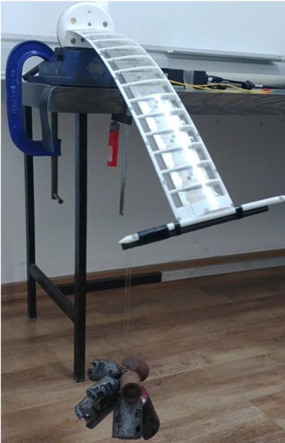

```@meta
EditURL = "../../../test/examples/PazyWingTorsionTest.jl"
```

# Static structural analysis of the Pazy wing
This example illustrates how to set up a static structural analysis, using the Technion's Pazy wing benchmark. More specifically, we'll simulate a coupled bending-torsion test. The sectional properties of the wing's spar and the aerodynamic tip loss function were defined by [Riso and Cesnik](https://doi.org/10.2514/6.2022-2313). That data is publicly available at [https://github.com/UM-A2SRL/AePW3-LDWG](https://github.com/UM-A2SRL/AePW3-LDWG).


*Pazy wing coupled bending-torsion test* by [Avin et al.](https://doi.org/10.2514/1.J060621)

!!! tip
    The code for this example is available [here](https://github.com/luizpancini/AeroBeams.jl/blob/main/test/examples/PazyWingTorsionTest.jl).

### Problem setup
Let's begin by setting the variables of our problem. In this example we will analyze the displacements and twist of the clamped wing caused by the attachment of a range of tip masses. Notice that we bring into scope some fixed geometrical and discretization properties of the wing's beam through the function [`geometrical_properties_Pazy`](@ref geometrical_properties_Pazy).

````@example PazyWingTorsionTest
using AeroBeams, DelimitedFiles

# Fixed geometrical properties
nElem,L,chord,normSparPos = geometrical_properties_Pazy()

# Set tip mass range
mRange = collect(0:0.1:3)

# Initialize outputs
tip_twist = Array{Float64}(undef,length(mRange))
tip_OOP = Array{Float64}(undef,length(mRange))
nothing #hide
````

### Solving the problem
In the following loop, we create new model instances for each tip mass value, create and solve the steady problem, and then extract the outputs of interest. The tip mass is positioned in such a way to cause not only bending but also significant torsion of the wing. The model creation process is streamlined with the function [`create_Pazy`](@ref create_Pazy), taking the appropriate inputs. Notice that the twist angle is computed as the arcsine of the difference in "height" between the leading edge and trailing edge of the wingtip (throught the rotation of the local basis vector pointing in the x2-direction).

````@example PazyWingTorsionTest
# Sweep tip mass
for (i,m) in enumerate(mRange)
    # Create model with current tip mass 80 mm behind the trailing-edge
    PazyWingTorsionTest,_ = create_Pazy(tipMass=m,ηtipMass=[0;-(chord*(1-normSparPos)+0.08);0])
    # Create and solve problem
    global problem = create_SteadyProblem(model=PazyWingTorsionTest)
    solve!(problem)
    # Get twist and OOP displacement at midchord
    tip_p = problem.nodalStatesOverσ[end][nElem].p_n2
    R,_ = rotation_tensor_WM(tip_p)
    Δ = R*[0; 1; 0]
    tip_twist[i] = asind(Δ[3])
    tip_OOP[i] = problem.nodalStatesOverσ[end][nElem].u_n2[3] - chord*(1/2-normSparPos)*sind(tip_twist[i])
end
nothing #hide
````

### Post-processing
The post-processing begins by loading the reference data.

````@example PazyWingTorsionTest
# Load reference data
u3Exp = readdlm(pkgdir(AeroBeams)*"/test/referenceData/Pazy/torsion_u3VsMass_Exp.txt")
u3UMNAST = readdlm(pkgdir(AeroBeams)*"/test/referenceData/Pazy/torsion_u3VsMass_UMNAST.txt")
θExp = readdlm(pkgdir(AeroBeams)*"/test/referenceData/Pazy/torsion_thetaVsMass_Exp.txt")
θUMNAST = readdlm(pkgdir(AeroBeams)*"/test/referenceData/Pazy/torsion_thetaVsMass_UMNAST.txt")
nothing #hide
````

We can now plot the out-of-plane (OOP) tip displacement and tip twist as functions of the tip mass. The following "experimental" results were taken from Figure 17 of the paper by [Avin et al.](https://doi.org/10.2514/1.J060621). The correlation with the reference data is good.

````@example PazyWingTorsionTest
using Plots
gr()
ENV["GKSwstype"] = "100" #hide

# Tip midchord OOP displacement (offset from zero tip mass value) vs. tip mass
plt1 = plot(xlabel="Tip mass [kg]", ylabel="Tip OOP displacement offset [% semispan]", xlims=[mRange[1],mRange[end]])
plot!(mRange, (tip_OOP.-tip_OOP[1])/L*100, c=:black, lw=2, label="AeroBeams")
plot!(u3UMNAST[1,:], u3UMNAST[2,:], c=:blue, ls=:dash, lw=2, label="UM/NAST")
scatter!(u3Exp[1,:], u3Exp[2,:], mc=:red, ms=4, msw=0, label="Experimental")
savefig("PazyWingTorsionTest_OOP.svg") #hide
nothing #hide

# Tip twist vs. tip mass
plt2 = plot(xlabel="Tip mass [kg]", ylabel="Tip twist [deg]", xlims=[mRange[1],mRange[end]])
plot!(mRange, tip_twist, c=:black, lw=2, label="AeroBeams")
plot!(θUMNAST[1,:], θUMNAST[2,:], c=:blue, ls=:dash, lw=2, label="UM/NAST")
scatter!(θExp[1,:], θExp[2,:], mc=:red, ms=4, msw=0, label="Experimental")
savefig("PazyWingTorsionTest_twist.svg") #hide
nothing #hide
````


---

*This page was generated using [Literate.jl](https://github.com/fredrikekre/Literate.jl).*

