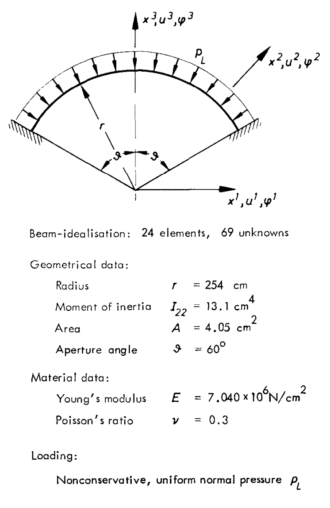

```@meta
EditURL = "../../../test/examples/archUnderFollowerPressure.jl"
```

# Static structural analysis of an arch under follower pressure
This example simulates the static response of a clamped arch subjected to a normal (follower) pressure. It illustrates how to set up a steady structural problem for an initially curved beam subjected to follower distributed loads. The problem was defined by [Argyris and Symeonidis](https://doi.org/10.1016/0045-7825(81)90131-6).


*Clamped circular arch under normal pressure* by [Argyris and Symeonidis](https://doi.org/10.1016/0045-7825(81)90131-6)

### Beam
The first step is to create a beam. The arch has radius `R` and spans over and angle `θ`. The curvature of the beam is thus `1/R`, and the total length is `L=Rθ`. We define the beam orientation such that the arch spans from an angle `-θ/2` to `θ/2` about a vertical line. This is done by specifying the rotation parameters from basis `A` to basis `b`, `p0`, with the Euler parameters sequence 3-2-1: the angle of rotation about the second axis is `-θ/2`. The cross-section has area `A` and bending moment of inertia `Iy`. The elastic modulus of the material is `E`. We discretize the beam into `nElem` finite elements. In this case the properties of the beam are constant over its length, to see a case where those properties vary, check this [example](https://github.com/luizpancini/AeroBeams.jl/blob/main/test/examples/taperedBeamEigen.jl).

````@example archUnderFollowerPressure
# Beam
using AeroBeams

R,θ = 2.54,120*π/180
k2 = 1/R
L = R*θ
A,Iy = 4.05e-4,13.1e-8
E = 70.4e9
EA,EIy = E*A,E*Iy
nElem = 40
beam = create_Beam(name="arch",length=L,nElements=nElem,C=[isotropic_stiffness_matrix(∞=1e12,EA=EA,EIy=EIy)],rotationParametrization="E321",p0=[0;-θ/2;0],k=[0;k2;0])
nothing #hide
````

### BCs
Now we create the boundary conditions (including the pressure load). The normalized load is defined by the `λ` variable, and the maximum value of the actual distributed load per unit length is `q`. We add this constant load to the arch as a distributed follower force initially resolved in basis `A`. We then clamp both ends of the beam (nodes `1` and `nElem+1`) by setting the displacements and rotations to zero.

````@example archUnderFollowerPressure
# BCs
λ = 11
q = -λ*EIy/R^2
add_loads_to_beam!(beam,loadTypes=["ff_b_of_x1t"],loadFuns=[(x1,t)->[0; 0; q]])
clamp1 = create_BC(name="clamp1",beam=beam,node=1,types=["u1A","u2A","u3A","p1A","p2A","p3A"],values=[0,0,0,0,0,0])
clamp2 = create_BC(name="clamp2",beam=beam,node=nElem+1,types=["u1A","u2A","u3A","p1A","p2A","p3A"],values=[0,0,0,0,0,0])
nothing #hide
````

### Model
We are now ready to create the model itself. It is composed of the beam and the boundary conditions.

````@example archUnderFollowerPressure
# Model
archUnderFollowerPressure = create_Model(name="archUnderFollowerPressure",beams=[beam],BCs=[clamp1,clamp2])
nothing #hide
````

### System solver
We can set an optional system solver for the nonlinear algebraic system of equations resulting from the finite element discretization. In this case we choose to start with a load factor `σ0` and increase it in steps `σstep` (up to the ultimate load factor of one). We then create a Newton-Raphson solver with these options.

````@example archUnderFollowerPressure
# System solver
σ0 = 0
σstep = 0.02
NR = create_NewtonRaphson(initialLoadFactor=σ0,maximumLoadFactorStep=σstep)
nothing #hide
````

### Problem
Now we define the steady problem, by inputting the model and our optional system solver, and then solve it.

````@example archUnderFollowerPressure
# Problem
problem = create_SteadyProblem(model=archUnderFollowerPressure,systemSolver=NR)
solve!(problem)
nothing #hide
````

### Post-processing
We are interested in the behavior of the arch's midpoint transverse displacement (in the x3 direction) as a function of the load. So we can get solution at all partial load steps. The array of the partial load factors is `σVector`, and the corresponding midpoint displacements are `mid_u3`.

````@example archUnderFollowerPressure
# Unpack outputs
σVector = problem.savedσ
mid_u3 = [problem.nodalStatesOverσ[i][div(nElem,2)].u_n2[3] for i in 1:length(σVector)]
nothing #hide
````

The following plot shows the midpoint displacement as a function of the load.

````@example archUnderFollowerPressure
using Plots
gr()
ENV["GKSwstype"] = "100" #hide
# Plot displacement
plot(-mid_u3/R, σVector*λ, color=:black, lw=2, xlabel="Midpoint \$-u_3/R\$", ylabel="\$\\lambda\$", label=false)
savefig("archUnderFollowerPressure_disp.svg") #hide
nothing #hide
````


Let's also plot the initial and final deformed shape of the arch (scaled ten-fold), along with the boundary conditions. To do that, we exploit AeroBeams' built-in visualization capabilities, by simply calling the `plot_steady_deformation()` function accordingly.

````@example archUnderFollowerPressure
# Plot deformed shape
plot_steady_deformation(problem,scale=10,showScale=true,scalePos=[0.5,2.2])
savefig("archUnderFollowerPressure-deformed.svg") #hide
nothing #hide
````


---

*This page was generated using [Literate.jl](https://github.com/fredrikekre/Literate.jl).*

