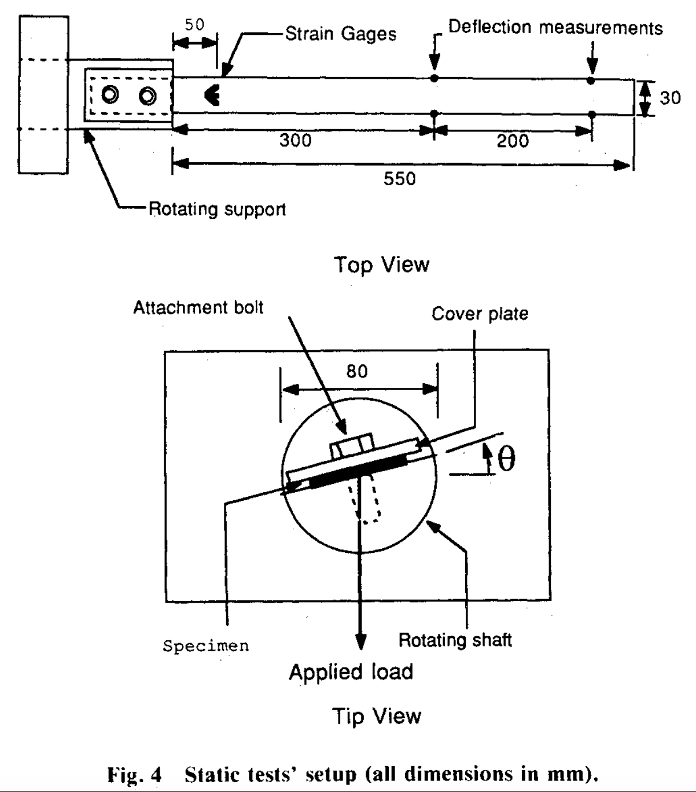
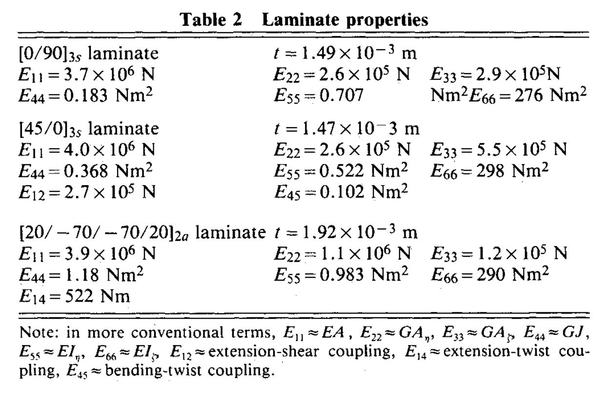

```@meta
EditURL = "../../../test/examples/compositeCantileverMD.jl"
```

# Static structural analysis of composite beams
This example illustrates how to set up a static structural analysis of composite beams. We will investigate the deflection of several composite beams under tip loads caused by attached weights. This problem was proposed by [Minguet and Dugundji](https://doi.org/10.2514/3.25255):



*Beam geometry* by [Minguet and Dugundji](https://doi.org/10.2514/3.25255)



*Laminate properties* by [Minguet and Dugundji](https://doi.org/10.2514/3.25255)

### Problem setup
Let's begin by setting up the variables of our problem. We create three beams, each of a different composite laminate, clamp them ar the root, and apply the tip load. Notice that only beam 1 has a diagonal sectional stiffness matrix, whereas the others have coupling terms.

````@example compositeCantileverMD
using AeroBeams, LinearAlgebra, DelimitedFiles

# Properties common to all beams
L = 0.55
nElem = 22

# Rotation angles
θRange = π/4*[0, 1]

# Gravity
g = 9.80665

# Tip load mass
m = 0.5

# Tip weight
W = m*g

# Beam 1
stiffnessMatrix1 = diagm([3.7e6,2.6e5,2.9e5,0.183,0.707,276])
beam1 = create_Beam(name="beam1",length=L,nElements=nElem,C=[stiffnessMatrix1],rotationParametrization="E321")

# Beam 2
stiffnessMatrix2 = diagm([4e6,2.6e5,5.5e5,0.368,0.522,298])
stiffnessMatrix2[1,2] = stiffnessMatrix2[2,1] = -2.7e5
stiffnessMatrix2[4,5] = stiffnessMatrix2[5,4] = -0.102
beam2 = create_Beam(name="beam2",length=L,nElements=nElem,C=[stiffnessMatrix2],rotationParametrization="E321")

# Beam 3
stiffnessMatrix3 = diagm([3.9e6,1.1e6,1.2e5,1.18,0.983,290])
stiffnessMatrix3[1,4] = stiffnessMatrix3[4,1] = -522
beam3 = create_Beam(name="beam3",length=L,nElements=nElem,C=[stiffnessMatrix3],rotationParametrization="E321")

# BCs
clamp1 = create_BC(name="clamp1",beam=beam1,node=1,types=["u1A","u2A","u3A","p1A","p2A","p3A"],values=[0,0,0,0,0,0])
tipLoad1 = create_BC(name="tipLoad1",beam=beam1,node=nElem+1,types=["F3A"],values=[-W])
clamp2 = create_BC(name="clamp2",beam=beam2,node=1,types=["u1A","u2A","u3A","p1A","p2A","p3A"],values=[0,0,0,0,0,0])
tipLoad2 = create_BC(name="tipLoad2",beam=beam2,node=nElem+1,types=["F3A"],values=[-W])
clamp3 = create_BC(name="clamp3",beam=beam3,node=1,types=["u1A","u2A","u3A","p1A","p2A","p3A"],values=[0,0,0,0,0,0])
tipLoad3 = create_BC(name="tipLoad3",beam=beam3,node=nElem+1,types=["F3A"],values=[-W])

# Models
compositeCantilever1 = create_Model(name="compositeCantilever1",beams=[beam1],BCs=[clamp1,tipLoad1])
compositeCantilever2 = create_Model(name="compositeCantilever2",beams=[beam2],BCs=[clamp2,tipLoad2])
compositeCantilever3 = create_Model(name="compositeCantilever3",beams=[beam3],BCs=[clamp3,tipLoad3])

# Set system solver options
σ0 = 0
σstep = 0.1
NR = create_NewtonRaphson(initialLoadFactor=σ0,maximumLoadFactorStep=σstep,minimumLoadFactorStep=σstep)

# Initialize outputs: displacements at x1 = 500 mm
σVector = Array{Vector{Float64}}(undef,3,2)
u1_500mm = Array{Vector{Float64}}(undef,3,2)
u2_500mm = Array{Vector{Float64}}(undef,3,2)
u3_500mm = Array{Vector{Float64}}(undef,3,2)
nothing #hide
````

### Problem solution
We can sweep the range of root rotation angle, `θRange`, to find the solution at each value for each beam.

````@example compositeCantileverMD
# Loop root angles
for (j,θ) in enumerate(θRange)
    # Update beams' rotation
    beam1.p0[3] = beam2.p0[3] = beam3.p0[3] = θ
    update_beam!(beam1); update_model!(compositeCantilever1)
    update_beam!(beam2); update_model!(compositeCantilever2)
    update_beam!(beam3); update_model!(compositeCantilever3)
    # Create and solve the problems
    problem1 = create_SteadyProblem(model=compositeCantilever1,systemSolver=NR)
    problem2 = create_SteadyProblem(model=compositeCantilever2,systemSolver=NR)
    problem3 = create_SteadyProblem(model=compositeCantilever3,systemSolver=NR)
    solve!(problem1)
    solve!(problem2)
    solve!(problem3)
    # Save outputs
    σVector[1,j] = problem1.savedσ
    σVector[2,j] = problem2.savedσ
    σVector[3,j] = problem3.savedσ
    u1_500mm[1,j] = [problem1.nodalStatesOverσ[i][nElem-1].u_n1[1] for i in 1:length(σVector[1,j])]
    u1_500mm[2,j] = [problem2.nodalStatesOverσ[i][nElem-1].u_n1[1] for i in 1:length(σVector[2,j])]
    u1_500mm[3,j] = [problem3.nodalStatesOverσ[i][nElem-1].u_n1[1] for i in 1:length(σVector[3,j])]
    u2_500mm[1,j] = [problem1.nodalStatesOverσ[i][nElem-1].u_n1[2] for i in 1:length(σVector[1,j])]
    u2_500mm[2,j] = [problem2.nodalStatesOverσ[i][nElem-1].u_n1[2] for i in 1:length(σVector[2,j])]
    u2_500mm[3,j] = [problem3.nodalStatesOverσ[i][nElem-1].u_n1[2] for i in 1:length(σVector[3,j])]
    u3_500mm[1,j] = [problem1.nodalStatesOverσ[i][nElem-1].u_n1[3] for i in 1:length(σVector[1,j])]
    u3_500mm[2,j] = [problem2.nodalStatesOverσ[i][nElem-1].u_n1[3] for i in 1:length(σVector[2,j])]
    u3_500mm[3,j] = [problem3.nodalStatesOverσ[i][nElem-1].u_n1[3] for i in 1:length(σVector[3,j])]
end
nothing #hide
````

### Post-processing
Let's load the reference experimental solution by [Minguet and Dugundji](https://doi.org/10.2514/3.25255).

````@example compositeCantileverMD
# Load reference solution
u1_b1_th0_ref = readdlm(pkgdir(AeroBeams)*"/test/referenceData/compositeCantileverMD/b1_th0_u1.txt")
u2_b1_th0_ref = readdlm(pkgdir(AeroBeams)*"/test/referenceData/compositeCantileverMD/b1_th0_u2.txt")
u3_b1_th0_ref = readdlm(pkgdir(AeroBeams)*"/test/referenceData/compositeCantileverMD/b1_th0_u3.txt")
u1_b1_th45_ref = readdlm(pkgdir(AeroBeams)*"/test/referenceData/compositeCantileverMD/b1_th45_u1.txt")
u2_b1_th45_ref = readdlm(pkgdir(AeroBeams)*"/test/referenceData/compositeCantileverMD/b1_th45_u2.txt")
u3_b1_th45_ref = readdlm(pkgdir(AeroBeams)*"/test/referenceData/compositeCantileverMD/b1_th45_u3.txt")
u1_b2_th0_ref = readdlm(pkgdir(AeroBeams)*"/test/referenceData/compositeCantileverMD/b2_th0_u1.txt")
u2_b2_th0_ref = readdlm(pkgdir(AeroBeams)*"/test/referenceData/compositeCantileverMD/b2_th0_u2.txt")
u3_b2_th0_ref = readdlm(pkgdir(AeroBeams)*"/test/referenceData/compositeCantileverMD/b2_th0_u3.txt")
u1_b2_th45_ref = readdlm(pkgdir(AeroBeams)*"/test/referenceData/compositeCantileverMD/b2_th45_u1.txt")
u2_b2_th45_ref = readdlm(pkgdir(AeroBeams)*"/test/referenceData/compositeCantileverMD/b2_th45_u2.txt")
u3_b2_th45_ref = readdlm(pkgdir(AeroBeams)*"/test/referenceData/compositeCantileverMD/b2_th45_u3.txt")
u1_b3_th0_ref = readdlm(pkgdir(AeroBeams)*"/test/referenceData/compositeCantileverMD/b3_th0_u1.txt")
u2_b3_th0_ref = readdlm(pkgdir(AeroBeams)*"/test/referenceData/compositeCantileverMD/b3_th0_u2.txt")
u3_b3_th0_ref = readdlm(pkgdir(AeroBeams)*"/test/referenceData/compositeCantileverMD/b3_th0_u3.txt")
u1_b3_th45_ref = readdlm(pkgdir(AeroBeams)*"/test/referenceData/compositeCantileverMD/b3_th45_u1.txt")
u2_b3_th45_ref = readdlm(pkgdir(AeroBeams)*"/test/referenceData/compositeCantileverMD/b3_th45_u2.txt")
u3_b3_th45_ref = readdlm(pkgdir(AeroBeams)*"/test/referenceData/compositeCantileverMD/b3_th45_u3.txt")
nothing #hide
````

Finally, we may plot the displacements at ``x_1 = 500`` mm for each beam in each configuration. The correlation with the experimental data is good, and matches the numerical results of [Minguet and Dugundji](https://doi.org/10.2514/3.25255) as well (not shown).

````@example compositeCantileverMD
using Plots
gr()
ENV["GKSwstype"] = "100" #hide
nothing #hide

# Plot configurations
labels = ["\$-u_1\$" "\$u_2\$" "\$-u_3\$"]
xLabel = "\$-u_1, u_2, -u_3\$ [m]"
yLabel = "Load [grams]"
colors = [:blue,:orange,:green]
lw = 2
ms = 5
msw = 0

# Beam 1, θ=0⁰
plt11 = plot(xlabel=xLabel, ylabel=yLabel, title="Beam 1, \$\\theta=0^{\\degree}\$")
plot!([NaN], [NaN], lc=:black, lw=lw, label="AeroBeams")
scatter!([NaN], [NaN], mc=:black, ms=ms, label=" Experimental")
for i=1:3
    plot!([NaN], [NaN], c=colors[i], m=colors[i], lw=lw, ms=ms, msw=msw, label=labels[i])
end
for (x, c) in zip([-u1_500mm[1,1], u2_500mm[1,1], -u3_500mm[1,1]], colors)
    plot!(x, σVector[1,1]*W/g*1e3, c=c, lw=lw, label=false)
end
for (x, y, c) in zip([u1_b1_th0_ref[1,:], u2_b1_th0_ref[1,:], u3_b1_th0_ref[1,:]], [u1_b1_th0_ref[2,:], u2_b1_th0_ref[2,:], u3_b1_th0_ref[2,:]], colors)
    scatter!(x, y, c=c, ms=ms, msw=msw, label=false)
end
savefig("compositeCantileverMD_b1th0.svg") #hide
nothing #hide

# Beam 1, θ=45⁰
plt12 = plot(xlabel=xLabel, ylabel=yLabel, title="Beam 1, \$\\theta=45^{\\degree}\$")
plot!([NaN], [NaN], lc=:black, lw=lw, label="AeroBeams")
scatter!([NaN], [NaN], mc=:black, ms=ms, label="  Experimental")
for i=1:3
    plot!([NaN], [NaN], c=colors[i], m=colors[i], lw=lw, ms=ms, msw=msw, label=labels[i])
end
for (x, c) in zip([-u1_500mm[1,2], u2_500mm[1,2], -u3_500mm[1,2]], colors)
    plot!(x, σVector[1,2]*W/g*1e3, c=c, lw=lw, label=false)
end
for (x, y, c) in zip([u1_b1_th45_ref[1,:], u2_b1_th45_ref[1,:], u3_b1_th45_ref[1,:]], [u1_b1_th45_ref[2,:], u2_b1_th45_ref[2,:], u3_b1_th45_ref[2,:]], colors)
    scatter!(x, y, c=c, ms=ms, msw=msw, label=false)
end
savefig("compositeCantileverMD_b1th45.svg") #hide
nothing #hide

# Beam 2, θ=0⁰
plt21 = plot(xlabel=xLabel, ylabel=yLabel, title="Beam 2, \$\\theta=0^{\\degree}\$")
plot!([NaN], [NaN], lc=:black, lw=lw, label="AeroBeams")
scatter!([NaN], [NaN], mc=:black, ms=ms, label="  Experimental")
for i=1:3
    plot!([NaN], [NaN], c=colors[i], m=colors[i], lw=lw, ms=ms, msw=msw, label=labels[i])
end
for (x, c) in zip([-u1_500mm[2,1], u2_500mm[2,1], -u3_500mm[2,1]], colors)
    plot!(x, σVector[2,1]*W/g*1e3, c=c, lw=lw, label=false)
end
for (x, y, c) in zip([u1_b2_th0_ref[1,:], u2_b2_th0_ref[1,:], u3_b2_th0_ref[1,:]], [u1_b2_th0_ref[2,:], u2_b2_th0_ref[2,:], u3_b2_th0_ref[2,:]], colors)
    scatter!(x, y, c=c, ms=ms, msw=msw, label=false)
end
savefig("compositeCantileverMD_b2th0.svg") #hide
nothing #hide

# Beam 2, θ=45⁰
plt22 = plot(xlabel=xLabel, ylabel=yLabel, title="Beam 2, \$\\theta=45^{\\degree}\$", legend=:bottomright)
plot!([NaN], [NaN], lc=:black, lw=lw, label="AeroBeams")
scatter!([NaN], [NaN], mc=:black, ms=ms, label="  Experimental")
for i=1:3
    plot!([NaN], [NaN], c=colors[i], m=colors[i], lw=lw, ms=ms, msw=msw, label=labels[i])
end
for (x, c) in zip([-u1_500mm[2,2], u2_500mm[2,2], -u3_500mm[2,2]], colors)
    plot!(x, σVector[2,2]*W/g*1e3, c=c, lw=lw, label=false)
end
for (x, y, c) in zip([u1_b2_th45_ref[1,:], u2_b2_th45_ref[1,:], u3_b2_th45_ref[1,:]], [u1_b2_th45_ref[2,:], u2_b2_th45_ref[2,:], u3_b2_th45_ref[2,:]], colors)
    scatter!(x, y, c=c, ms=ms, msw=msw, label=false)
end
savefig("compositeCantileverMD_b2th45.svg") #hide
nothing #hide

# Beam 3, θ=0⁰
plt31 = plot(xlabel=xLabel, ylabel=yLabel, title="Beam 3, \$\\theta=0^{\\degree}\$")
plot!([NaN], [NaN], lc=:black, lw=lw, label="AeroBeams")
scatter!([NaN], [NaN], mc=:black, ms=ms, label="  Experimental")
for i=1:3
    plot!([NaN], [NaN], c=colors[i], m=colors[i], lw=lw, ms=ms, msw=msw, label=labels[i])
end
for (x, c) in zip([-u1_500mm[3,1], u2_500mm[3,1], -u3_500mm[3,1]], colors)
    plot!(x, σVector[3,1]*W/g*1e3, c=c, lw=lw, label=false)
end
for (x, y, c) in zip([u1_b3_th0_ref[1,:], u2_b3_th0_ref[1,:], u3_b3_th0_ref[1,:]], [u1_b3_th0_ref[2,:], u2_b3_th0_ref[2,:], u3_b3_th0_ref[2,:]], colors)
    scatter!(x, y, c=c, ms=ms, msw=msw, label=false)
end
savefig("compositeCantileverMD_b3th0.svg") #hide
nothing #hide

# Beam 3, θ=45⁰
plt32 = plot(xlabel=xLabel, ylabel=yLabel, title="Beam 3, \$\\theta=45^{\\degree}\$")
plot!([NaN], [NaN], lc=:black, lw=lw, label="AeroBeams")
scatter!([NaN], [NaN], mc=:black, ms=ms, label="  Experimental")
for i=1:3
    plot!([NaN], [NaN], c=colors[i], m=colors[i], lw=lw, ms=ms, msw=msw, label=labels[i])
end
for (x, c) in zip([-u1_500mm[3,2], u2_500mm[3,2], -u3_500mm[3,2]], colors)
    plot!(x, σVector[3,2]*W/g*1e3, c=c, lw=lw, label=false)
end
for (x, y, c) in zip([u1_b3_th45_ref[1,:], u2_b3_th45_ref[1,:], u3_b3_th45_ref[1,:]], [u1_b3_th45_ref[2,:], u2_b3_th45_ref[2,:], u3_b3_th45_ref[2,:]], colors)
    scatter!(x, y, c=c, ms=ms, msw=msw, label=false)
end
savefig("compositeCantileverMD_b3th45.svg") #hide
nothing #hide
````


---

*This page was generated using [Literate.jl](https://github.com/fredrikekre/Literate.jl).*

