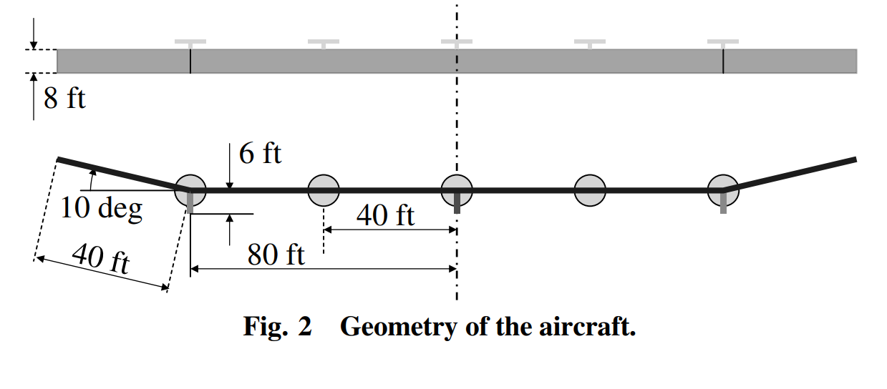

```@meta
EditURL = "../../../test/examples/heliosTrim.jl"
```

# Trimming a flying-wing HALE
This example illustrates how to set up a trim analysis of an aircraft in free flight. For that we take a model of the [Helios aircraft](https://en.wikipedia.org/wiki/AeroVironment_Helios_Prototype), a 75 meters wingspan flying-wing HALE. This aircraft model was described in [Patil and Hodges](https://doi.org/10.2514/1.17640):


*Flying-wing HALE model geometry* by [Patil and Hodges](https://doi.org/10.2514/1.17640)


*Flying-wing properties* by [Patil and Hodges](https://doi.org/10.2514/1.17640)

!!! tip
    The code for this example is available [here](https://github.com/luizpancini/AeroBeams.jl/blob/main/test/examples/heliosTrim.jl).

### Problem setup
Let's begin by setting up the variables of our problem. We select the airfoil for the wing, and the optional flags to include the vertical beam pods and of setting the payload on the wing. Our set up matches that of [Patil and Hodges](https://doi.org/10.2514/1.17640). We will investigate the longitudinal trim of the aircraft at both rigid and elastic (nominal) configurations, using the payload at the center station as the varying parameter.

````@example heliosTrim
using AeroBeams, DelimitedFiles

# Wing airfoil
wingAirfoil = deepcopy(HeliosWingAirfoil)

# Flag to include beam pods
beamPods = true

# Flag to set payload on wing
payloadOnWing = false

# Aerodynamic solver
aeroSolver = Indicial()

# Set NR system solver
relaxFactor = 0.5
NR = create_NewtonRaphson(ρ=relaxFactor)

# Airspeed (40 ft/s) [m]
U = 40*0.3048

# Set stiffness factor and payload ranges
λRange = [1,50]
PRange = collect(0:20:500)

# Initialize outputs
problem = Array{TrimProblem}(undef,length(λRange),length(PRange))
trimAoA = Array{Float64}(undef,length(λRange),length(PRange))
trimThrust = Array{Float64}(undef,length(λRange),length(PRange))
trimδ = Array{Float64}(undef,length(λRange),length(PRange))
nothing #hide
````

### Solving the problem
At this point we can sweep the stiffness factor and payload vectors to find the trim solution at each value.

````@example heliosTrim
# Sweep stiffness factor
for (i,λ) in enumerate(λRange)
    # Sweep payload
    for (j,P) in enumerate(PRange)
        # Model
        helios,midSpanElem,_ = create_Helios(aeroSolver=aeroSolver,beamPods=beamPods,wingAirfoil=wingAirfoil,payloadOnWing=payloadOnWing,stiffnessFactor=λ,payloadPounds=P,airspeed=U,δIsTrimVariable=true,thrustIsTrimVariable=true)
        # Set initial guess solution as previous known solution
        x0 = (j==1) ? zeros(0) : problem[i,j-1].x
        # Create and solve trim problem
        problem[i,j] = create_TrimProblem(model=helios,systemSolver=NR,x0=x0)
        solve!(problem[i,j])
        # Trim results
        trimAoA[i,j] = problem[i,j].aeroVariablesOverσ[end][midSpanElem].flowAnglesAndRates.αₑ*180/π
        trimThrust[i,j] = problem[i,j].x[end-1]*problem[i,j].model.forceScaling
        trimδ[i,j] = problem[i,j].x[end]*180/π
    end
end
nothing #hide
````

### Post-processing
The first post-processing step is to load the reference data by [Patil and Hodges](https://doi.org/10.2514/1.17640).

````@example heliosTrim
# Load reference data
αFlexibleRef = readdlm(pkgdir(AeroBeams)*"/test/referenceData/Helios/trim_AoA_flexible.txt")
αRigidRef = readdlm(pkgdir(AeroBeams)*"/test/referenceData/Helios/trim_AoA_rigid.txt")
δFlexibleRef = readdlm(pkgdir(AeroBeams)*"/test/referenceData/Helios/trim_delta_flexible.txt")
δRigidRef = readdlm(pkgdir(AeroBeams)*"/test/referenceData/Helios/trim_delta_rigid.txt")
TRef = readdlm(pkgdir(AeroBeams)*"/test/referenceData/Helios/trim_thrust.txt")
nothing #hide
````

We now plot the trim outputs as functions of the payload, for both rigid and elastic configurations. The agreement with the reference is very good. Notice that the thrust (per motor) remains almost constant, for both rigid and flexible aircraft, because the drag slope with flap deflection is assumed null (``c_{d_\delta} = 0``) and induced drag is neglected, so that only the parasite drag (``c_{d_0}``) component is present.

````@example heliosTrim
# Plot configurations
using Plots, ColorSchemes
gr()
ENV["GKSwstype"] = "100" #hide
colors = get(colorschemes[:rainbow], LinRange(0, 1, length(λRange)))
labels = ["Flexible" "Rigid"]
lw = 2
ms = 3
msw = 0
nothing #hide

# Trim root angle of attack
plt1 = plot(xlabel="Payload [lb]", ylabel="Trim root AoA [deg]", xlims=[0,500], ylims=[0,5])
plot!([NaN], [NaN], c=:black, lw=lw, label="AeroBeams")
scatter!([NaN], [NaN], c=:black, ms=ms, label="Patil & Hodges (2006)")
for (i,λ) in enumerate(λRange)
    plot!(PRange, trimAoA[i,:], c=colors[i], lw=lw, label=labels[i])
    if i==1
        scatter!(αFlexibleRef[1,:], αFlexibleRef[2,:], c=colors[i], ms=ms, msw=msw, label=false)
    else
        scatter!(αRigidRef[1,:], αRigidRef[2,:], c=colors[i], ms=ms, msw=msw, label=false)
    end
end
savefig("heliosTrim_AoA.svg") #hide

# Trim elevator deflection
plt2 = plot(xlabel="Payload [lb]", ylabel="Trim elevator deflection [deg]", xlims=[0,500], ylims=[0,10])
plot!([NaN], [NaN], c=:black, lw=lw, label="AeroBeams")
scatter!([NaN], [NaN], c=:black, ms=ms, label="Patil & Hodges (2006)")
for (i,λ) in enumerate(λRange)
    plot!(PRange, trimδ[i,:], c=colors[i], lw=lw, label=labels[i])
    if i==1
        scatter!(δFlexibleRef[1,:], δFlexibleRef[2,:], c=colors[i], ms=ms, msw=msw, label=false)
    else
        scatter!(δRigidRef[1,:], δRigidRef[2,:], c=colors[i], ms=ms, msw=msw, label=false)
    end
end
savefig("heliosTrim_delta.svg") #hide

# Trim thrust per motor
plt3 = plot(xlabel="Payload [lb]", ylabel="Trim thrust per motor [N]", xlims=[0,500], ylims=[0,60])
plot!([NaN], [NaN], c=:black, lw=lw, label="AeroBeams")
scatter!([NaN], [NaN], c=:black, ms=ms, label="Patil & Hodges (2006)")
for (i,λ) in enumerate(λRange)
    plot!(PRange, trimThrust[i,:], c=colors[i], lw=lw, label=labels[i])
    scatter!(TRef[1,:], TRef[2,:], c=colors[i], ms=ms, msw=msw, label=false)
end
savefig("heliosTrim_thrust.svg") #hide
nothing #hide
````


---

*This page was generated using [Literate.jl](https://github.com/fredrikekre/Literate.jl).*

