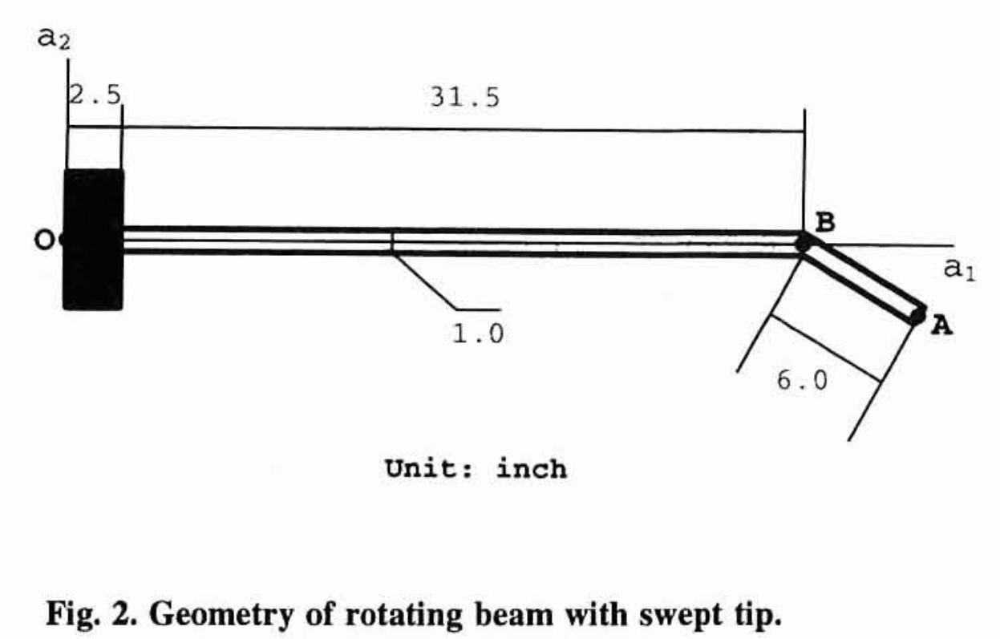

```@meta
EditURL = "../../../test/examples/sweptTipRotor.jl"
```

# Modal analysis of a rotating beam
This example illustrates how to set up a modal (eigen) analysis, using a swept-tip rotor. We will investigate the vibration modes of this rotor at several rotating speeds and several angles of the tip. This problem was proposed by [Hodges, Shang and Cesnik](https://doi.org/10.2514/6.1995-1174), based on the experiments of [Epps and Chandra](https://doi.org/10.4050/JAHS.41.29).



*Geometry of the swept-tip rotor* by [Hodges, Shang and Cesnik](https://doi.org/10.2514/6.1995-1174)

### Problem setup
To set up the problem, we need to define the geometric and material properties of the beams, to later create them. We also define the number of elements for each beam, the number of vibration modes to extract and the ranges for the angular velocity and the tip angle. Notice that the beam is clamped at a position `r0` relative to the axis of rotation, which is input to the function [`create_Model`](@ref create_Model) through the argument `initialPosition`. Moreover, the model assembly assumes by default that all the beams given by the `beams` argument are connected in sequence (*e.g.*, the first node of `tipBeam` is the same as the last of `baseBeam`).

````@example sweptTipRotor
using AeroBeams

# Geometric properties
L1,L2 = 31.5,6.0
b,H = 1,0.063
A,Iy,Iz = b*H,b*H^3/12,H*b^3/12
J = Is = Iy + Iz
Ksy,Ksz,Kt = 5/6,1/14.625,1/65.852
r0 = [2.5; 0.0; 0.0]

# Material properties (aluminum)
E = 1.06e7
G = E/(2*(1+0.325))
ρ = 2.51e-4

# Seciontal stiffness and inertia matrices
C = isotropic_stiffness_matrix(EA=E*A,GAy=G*A*Ksy,GAz=G*A*Ksz,GJ=G*J*Kt,EIy=E*Iy,EIz=E*Iz)
I = inertia_matrix(ρA=ρ*A,ρIy=ρ*Iy,ρIz=ρ*Iz,ρIs=ρ*Is)

# Discretization variables
nElemBeam1 = 20
nElemBeam2 = 10

# Range of angular velocity [rad/s]
ωRange = 2π/60*[0,500,750]

# Range of beam tip angles [rad]
tipAngleRange = π/180*collect(0:2.5:45)

# Number of modes
nModes = 8

# Beam frame
baseBeam = create_Beam(name="baseBeam",length=L1,nElements=nElemBeam1,C=[C],I=[I])
tipBeam = create_Beam(name="tipBeam",length=L2,nElements=nElemBeam2,C=[isotropic_stiffness_matrix(∞=1e12,EA=E*A,GAy=G*A*Ksy,GAz=G*A*Ksz,GJ=G*J*Kt,EIy=E*Iy,EIz=E*Iz)],I=[I],rotationParametrization="E321")

# BCs
clamp = create_BC(name="clamp",beam=baseBeam,node=1,types=["u1A","u2A","u3A","p1A","p2A","p3A"],values=[0,0,0,0,0,0])

# Create model
sweptTipRotor = create_Model(name="sweptTipRotor",beams=[baseBeam,tipBeam],BCs=[clamp],initialPosition=r0,units=create_UnitsSystem(length="in",force="lbf",frequency="Hz"))

# Initialize outputs
numFreqs = Matrix{Vector{Float64}}(undef,length(ωRange),length(tipAngleRange))
nothing #hide
````

### Solving the problem
We now solve an eigenproblem at each combination of tip angle and angular velocity, and extract the modal frequencies. Notice that we set the angular velocity of the entire model through the angular velocity of basis ``\mathcal{A}``, using the variable `ω_A`. AeroBeams will automatically solve the steady problem to find the deformed state of the model, and then perform an eigen-analysis around that state.

````@example sweptTipRotor
# Loop over sweep variables
for (i,ω) in enumerate(ωRange)
    # Set angular velocity of basis A
    sweptTipRotor.ω_A = [0; 0; ω]
    # Loop tip angles
    for (j,tipAngle) in enumerate(tipAngleRange)
        # Update tipBeam angle with tip angle
        tipBeam.p0[1] = -tipAngle
        update_beam!(tipBeam)
        # Update model
        sweptTipRotor.beams = [baseBeam,tipBeam]
        update_model!(sweptTipRotor)
        # Create and solve eigenproblem
        global problem = create_EigenProblem(model=sweptTipRotor,nModes=nModes)
        solve!(problem)
        # Get outputs
        numFreqs[i,j] = problem.frequenciesOscillatory
    end
end
nothing #hide
````

### Post-processing
We begin by loading the experimental values by [Epps and Chandra](https://doi.org/10.4050/JAHS.41.29).

````@example sweptTipRotor
# Experimental values
expTipAngles = [0, 15, 30, 45]
expFreqs1 = [1.4 1.8 1.7 1.6; 10.2 10.1 10.2 10.2; 14.8 14.4 14.9 14.7]
expFreqs2 = [10.3 10.2 10.4 10.4; 25.2 25.2 23.7 21.6; 36.1 34.8 30.7 26.1]
expFreqs3 = [27.7 27.2 26.6 24.8; 47.0 44.4 39.3 35.1; 62.9 55.9 48.6 44.8]
expFreqs4 = [95.4 87.5 83.7 78.8; 106.6 120.1 122.6 117.7; 132.7 147.3 166.2 162.0]
nothing #hide
````

Now we plot the evolution of the modal frequencies with the tip angle for the range of angular velocities. The numerical results agree well with the experimental ones, and match those described by [Hodges, Shang and Cesnik](https://doi.org/10.2514/6.1995-1174) and [Yu and Blair](https://doi.org/10.1016/j.compstruct.2012.04.007).

````@example sweptTipRotor
using Plots, ColorSchemes
gr()
ENV["GKSwstype"] = "100" #hide
colors = get(colorschemes[:darkrainbow], LinRange(0, 1, length(ωRange)))

# 1st bending mode
plt1 = plot(xlabel="Tip sweep angle [deg]", ylabel="Frequency [Hz]", title="1st bending", legend=(0.15,0.4))
plot!([NaN],[NaN], lc=:black, lw=2, label="AeroBeams")
scatter!([NaN],[NaN], mc=:black, ms=4, msw=0, label="Epps & Chandra (1996)")
for (i,ω) in enumerate(ωRange)
    mode = 1
    ωRPM = round(Int,ω/(2*π/60))
    numFreqs1 = [numFreqs[i,j][mode]/(2π) for j in 1:size(numFreqs, 2)]
    plot!(tipAngleRange*180/π,numFreqs1, lc=colors[i], lw=2, label=false)
    scatter!(expTipAngles,expFreqs1[i,:], mc=colors[i], ms=4, msw=0, label=false)
    plot!([NaN], [NaN], lc=colors[i], m=colors[i], lw=2, ms=4, msw=0, label="\$\\omega\$ = $ωRPM rpm")
end
savefig("sweptTipRotor_1B.svg") #hide
nothing #hide

# 2nd bending
plt2 = plot(xlabel="Tip sweep angle [deg]", ylabel="Frequency [Hz]", title="2nd bending", legend=(0.15,0.4))
plot!([NaN],[NaN], lc=:black, lw=2, label="AeroBeams")
scatter!([NaN],[NaN], mc=:black, ms=4, msw=0, label="Epps & Chandra (1996)")
for (i,ω) in enumerate(ωRange)
    mode = i < 3 ? 2 : 3
    ωRPM = round(Int,ω/(2*π/60))
    numFreqs2 = [numFreqs[i,j][mode]/(2π) for j in 1:size(numFreqs, 2)]
    plot!(tipAngleRange*180/π,numFreqs2, lc=colors[i], lw=2, label=false)
    scatter!(expTipAngles,expFreqs2[i,:], mc=colors[i], ms=4, msw=0, label=false)
    plot!([NaN], [NaN], lc=colors[i], m=colors[i], lw=2, ms=4, msw=0, label="\$\\omega\$ = $ωRPM rpm")
end
savefig("sweptTipRotor_2B.svg") #hide
nothing #hide

# 3rd bending mode
plt3 = plot(xlabel="Tip sweep angle [deg]", ylabel="Frequency [Hz]", title="3rd bending", legend=:topright)
plot!([NaN],[NaN], lc=:black, lw=2, label="AeroBeams")
scatter!([NaN],[NaN], mc=:black, ms=4, msw=0, label="Epps & Chandra (1996)")
for (i,ω) in enumerate(ωRange)
    mode = 4
    ωRPM = round(Int,ω/(2*π/60))
    numFreqs3 = [numFreqs[i,j][mode]/(2π) for j in 1:size(numFreqs, 2)]
    plot!(tipAngleRange*180/π,numFreqs3, lc=colors[i], lw=2, label=false)
    scatter!(expTipAngles,expFreqs3[i,:], mc=colors[i], ms=4, msw=0, label=false)
    plot!([NaN], [NaN], lc=colors[i], m=colors[i], lw=2, ms=4, msw=0, label="\$\\omega\$ = $ωRPM rpm")
end
savefig("sweptTipRotor_3B.svg") #hide
nothing #hide

# Coupled bending-torsion modes at ω = 750 rpm
plt4 = plot(xlabel="Tip sweep angle [deg]", ylabel="Frequency [Hz]", title="Coupled bending-torsion at \$\\omega\$ = 750 rpm", legend=(0.1,0.99))
plot!([NaN],[NaN], lc=:black, lw=2, label="AeroBeams")
scatter!([NaN],[NaN], mc=:black, ms=4, msw=0, label="Epps & Chandra (1996)")
modes = [5,6,7]
modeLabels = ["1T/5B","5B/1T","4B/1T"]
for (i,ω) in enumerate(ωRange)
    ωRPM = round(Int,ω/(2π/60))
    if i == 3
        numFreqsCoupled = zeros(length(tipAngleRange))
        for j in 1:size(numFreqs, 2)
            mode = tipAngleRange[j]*180/π >= 20 ? 8 : 7
            numFreqsCoupled[j] = numFreqs[end,j][mode]/(2π)
        end
    else
        mode = modes[i]
        numFreqsCoupled = [numFreqs[end,j][mode]/(2π) for j in 1:size(numFreqs, 2)]
    end
    plot!(tipAngleRange*180/π,numFreqsCoupled, c=colors[i], lw=2, label=false)
    scatter!(expTipAngles,expFreqs4[i,:], c=colors[i], ms=4, msw=0, label=false)
    plot!([NaN], [NaN], lc=colors[i], mc=colors[i], lw=2, ms=4, msw=0, label=modeLabels[i])
end
savefig("sweptTipRotor_TB.svg") #hide
nothing #hide
````


---

*This page was generated using [Literate.jl](https://github.com/fredrikekre/Literate.jl).*

