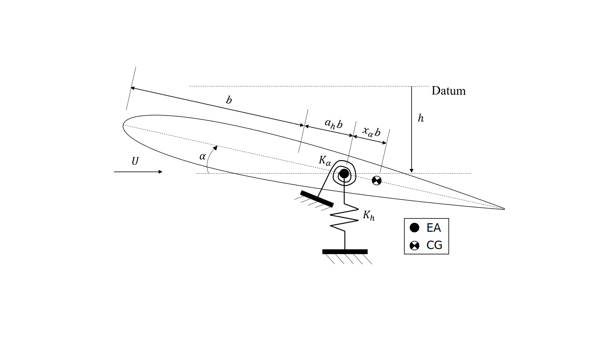

```@meta
EditURL = "../../../test/examples/typicalSectionFlutterAndDivergence.jl"
```

# Flutter and divergence of a typical aeroelastic section
This example illustrates how to set up a flutter/divergence analysis of a 2-DOF typical aeroelastic section. The typical section used was defined by [Hodges and Pierce](https://doi.org/10.1017/CBO9780511997112).


*Typical section*

!!! tip
    The code for this example is available [here](https://github.com/luizpancini/AeroBeams.jl/blob/main/test/examples/typicalSectionFlutterAndDivergence.jl).

### Problem setup
Let's begin by setting up the variables of our problem: we'll model the 2-DOF (pitch and plunge) typical section, which is a two-dimensional idealization, by setting up a rigid wing supported by displacement and rotation springs. We leverage the function [`typical_section_data`](@ref typical_section_data) to extract the typical section parameters.

````@example typicalSectionFlutterAndDivergence
using AeroBeams, LinearInterpolations, DelimitedFiles

# Aerodynamic solver
aeroSolver = Indicial()

# Derivation method
derivationMethod = FD(nothing)

# Atmosphere
altitude = 0
atmosphere = standard_atmosphere(altitude)
ρ = atmosphere.ρ

# Wing span
L = 1

# Given typical section data
typicalSectionName = "HP-1"
airfoil = deepcopy(flatPlate)
a,e,μ,rα²,σ,ωα,c = typical_section_data(typicalSectionName)

# Derived typical section data: semichord, distance from mass to elastic axis, total mass, pitching inertia, plunge stiffness and pitch stiffness
b = c/2
xα = e-a
m = μ * π*ρ*b^2 * L
ρIs = rα²*m*b^2
kh = m*(σ*ωα)^2
kα = ρIs*ωα^2

# Number of elements for the wing (the results are independent of it)
nElem = 2
nothing #hide
````

We now create the aerodynamic surface to be attached to the wing's beam, an array of point masses to be attached at each beam element at the specified CG position, the attachment springs, and the rigid beam of the wing. Two sliding journals (allowing only pitch and plunge motion) are added at the wingtips, further removing any elastic effects of the beam.

````@example typicalSectionFlutterAndDivergence
# Aerodynamic surface
surf = create_AeroSurface(solver=aeroSolver,derivationMethod=derivationMethod,airfoil=airfoil,c=c,normSparPos=(a+1)/2,updateAirfoilParameters=false)
nothing #hide

# Balance point masses - located at CG position over chord
pointMasses = Vector{PointInertia}(undef,nElem)
for e in 1:nElem
    pointMasses[e] = PointInertia(elementID=e,mass=m/nElem,η=[(-1)^(e+1)*L/nElem/2;-xα*b;0])
end

# Attachment springs
springs = create_Spring(elementsIDs=[1],nodesSides=[2],ku=kh*[0;0;1],kp=kα*[1;0;0])

# Rigid wing
∞ = 1e15
wing = create_Beam(name="wing",length=L,nElements=nElem,C=[isotropic_stiffness_matrix(∞=∞)],I=[inertia_matrix(ρIs=ρIs)],aeroSurface=surf,pointInertias=pointMasses,springs=[springs])

# BCs
journal1 = create_BC(name="journal-1",beam=wing,node=1,types=["u1A","u2A","p2A","p3A"],values=[0,0,0,0])
journal2 = create_BC(name="journal-2",beam=wing,node=nElem+1,types=["u1A","u2A","p2A","p3A"],values=[0,0,0,0])
nothing #hide
````

The model consists of the beam and boundary conditions. We also select the airspeed range for analysis, the number of oscillatory modes to be extracted and initialize the outputs.

````@example typicalSectionFlutterAndDivergence
# Model
typicalSectionFlutterAndDivergence = create_Model(name="typicalSectionFlutterAndDivergence",beams=[wing],BCs=[journal1,journal2])

# Airspeed range
URange = collect(1:0.5:80)

# Number of oscillatory modes
nModes = 2

# Pre-allocate memory and initialize output arrays
untrackedFreqs = Array{Vector{Float64}}(undef,length(URange))
untrackedDamps = Array{Vector{Float64}}(undef,length(URange))
untrackedEigenvectors = Array{Matrix{ComplexF64}}(undef,length(URange))
problem = Array{EigenProblem}(undef,length(URange))
nothing #hide
````

### Problem solution
We're now ready to solve the eigenproblem at each airspeed value.

````@example typicalSectionFlutterAndDivergence
# Sweep airspeed
for (i,U) in enumerate(URange)
    # Update airspeed on model
    set_motion_basis_A!(model=typicalSectionFlutterAndDivergence,v_A=[0;U;0])
    # Create and solve eigenproblem
    problem[i] = create_EigenProblem(model=typicalSectionFlutterAndDivergence,nModes=nModes,frequencyFilterLimits=[1e-3,1e3])
    solve!(problem[i])
    # Frequencies, dampings and eigenvectors
    untrackedFreqs[i] = problem[i].frequenciesOscillatory
    untrackedDamps[i] = round_off!(problem[i].dampingsOscillatory,1e-8)
    untrackedEigenvectors[i] = problem[i].eigenvectorsOscillatoryCplx
end
nothing #hide
````

### Post-processing
The first post-processing step is to use the built-in mode tracking algorithm to enhance our chances of correctly tracking the oscillatory modes. We then set arrays for the frequecies and dampings of each mode, and find the flutter onset and offset (actually absent in this case) speeds. To identify the divergence, we have to look at the damping of the non-oscillatory (zero-frequency) modes.

````@example typicalSectionFlutterAndDivergence
# Apply mode tracking
freqs,damps,_ = mode_tracking(URange,untrackedFreqs,untrackedDamps,untrackedEigenvectors)

# Separate frequencies and damping ratios by mode
modeFrequencies = Array{Vector{Float64}}(undef,nModes)
modeDampings = Array{Vector{Float64}}(undef,nModes)
for mode in 1:nModes
    modeFrequencies[mode] = [freqs[i][mode] for i in eachindex(URange)]
    modeDampings[mode] = [damps[i][mode] for i in eachindex(URange)]
end

# Flutter speed and flutter frequency
flutterOnsetSpeed = [Float64[] for _ in 1:nModes]
flutterOnsetFreq = [Float64[] for _ in 1:nModes]
flutterOffsetSpeed = [Float64[] for _ in 1:nModes]
flutterOffsetFreq = [Float64[] for _ in 1:nModes]
for mode in 1:nModes
    # Flutter onset
    iOnset = 1 .+ findall(i -> modeDampings[mode][i] < 0 && modeDampings[mode][i+1] > 0, 1:length(modeDampings[mode])-1)
    if isempty(iOnset) || isempty(filter!(x->x!=1,iOnset))
        continue
    end
    for i in iOnset
        push!(flutterOnsetSpeed[mode],interpolate(modeDampings[mode][i-1:i],URange[i-1:i],0))
        push!(flutterOnsetFreq[mode],interpolate(modeDampings[mode][i-1:i],modeFrequencies[mode][i-1:i],0))
    end
    # Flutter offset
    iOffset = 1 .+ findall(i -> modeDampings[mode][i] > 0 && modeDampings[mode][i+1] < 0, 1:length(modeDampings[mode])-1)
    if isempty(iOffset)
        continue
    end
    for i in iOffset
        push!(flutterOffsetSpeed[mode],interpolate(-modeDampings[mode][i-1:i],URange[i-1:i],0))
        push!(flutterOffsetFreq[mode],interpolate(-modeDampings[mode][i-1:i],modeFrequencies[mode][i-1:i],0))
    end
end

# Damping of non-oscillatory modes
dampingsNonOscillatory = [problem[i].dampingsNonOscillatory for i in eachindex(URange)]
nothing #hide
````

We also load a reference solution obtained using the ``p`` method for stability analysis using the unsteady aerodynamic theory of [Peters et al.](https://doi.org/10.2514/3.46718), as proposed in problem 5.7 of [Hodges and Pierce](https://doi.org/10.1017/CBO9780511997112).

````@example typicalSectionFlutterAndDivergence
# Load reference data
freqsRef = readdlm(pkgdir(AeroBeams)*"/test/referenceData/typicalSectionFlutterAndDivergence/freqs.txt")
dampsRef = readdlm(pkgdir(AeroBeams)*"/test/referenceData/typicalSectionFlutterAndDivergence/damps.txt")
nothing #hide
````

We'll visualize the results through the V-g-f diagrams, *i.e.*, the evolution of the frequencies and dampings (both normalized by the *in vacuo* pitching frequency) with airspeed. The flutter speed is that at which the damping of an oscillatory mode, in this case the pitch mode, becomes positive. Conversely, the divergence speed is that at which the damping of a non-oscillatory mode becomes positive. We can see that the correlation with the reference solution is very good, with flutter and divergence speeds being matched. Notice that once the damping of the non-oscillatory mode leading to divergence becomes positive, AeroBeams can no longer identify it. This is a current limitation of package, albeit the divergence speed can be found in spite of it.

````@example typicalSectionFlutterAndDivergence
using Plots, ColorSchemes
gr()
ENV["GKSwstype"] = "100" #hide
nothing #hide

# Plot configurations
modeColors = get(colorschemes[:rainbow], LinRange(0, 1, nModes+1))
modeLabels = ["Plunge" "Pitch"]
lw = 2
ms = 2

# Frequency plot
plt11 = plot(ylabel="Frequency ratio", ylims=[0,1.01])
for mode in 1:nModes
    plot!(URange, modeFrequencies[mode]/ωα, c=modeColors[mode], lw=lw,  label=false)
end
for r in 2:axes(freqsRef, 1)[end]
    plot!(freqsRef[1,:], freqsRef[r,:], ls=:dash, c=modeColors[end], lw=1, label=false)
end
# Damping plot
plt12 = plot(xlabel="Airspeed [m/s]", ylabel="Damping Ratio", ylims=[-0.15,0.15],legend=:topleft)
for i in eachindex(URange)
    for j in eachindex(dampingsNonOscillatory[i])
        scatter!([URange[i]], [dampingsNonOscillatory[i][j]/ωα], c=:black, ms=ms, msw=0, label=false)
    end
end
scatter!([NaN], [NaN], c=:black, ms=ms, msw=0, label="Non-oscillatory")
for mode in 1:nModes
    plot!(URange, modeDampings[mode]/ωα, c=modeColors[mode], lw=lw, label=modeLabels[mode])
end
for r in 2:axes(dampsRef, 1)[end]
    plot!(dampsRef[1,:], dampsRef[r,:], ls=:dash, c=modeColors[end], lw=1, label=false)
end
plot!([NaN], [NaN], ls=:dash, c=modeColors[end], lw=1, label="\$p\$ method")
plt1 = plot(plt11,plt12, layout=(2,1))
savefig("typicalSectionFlutter_Vgf.svg") #hide
nothing #hide
````


---

*This page was generated using [Literate.jl](https://github.com/fredrikekre/Literate.jl).*

