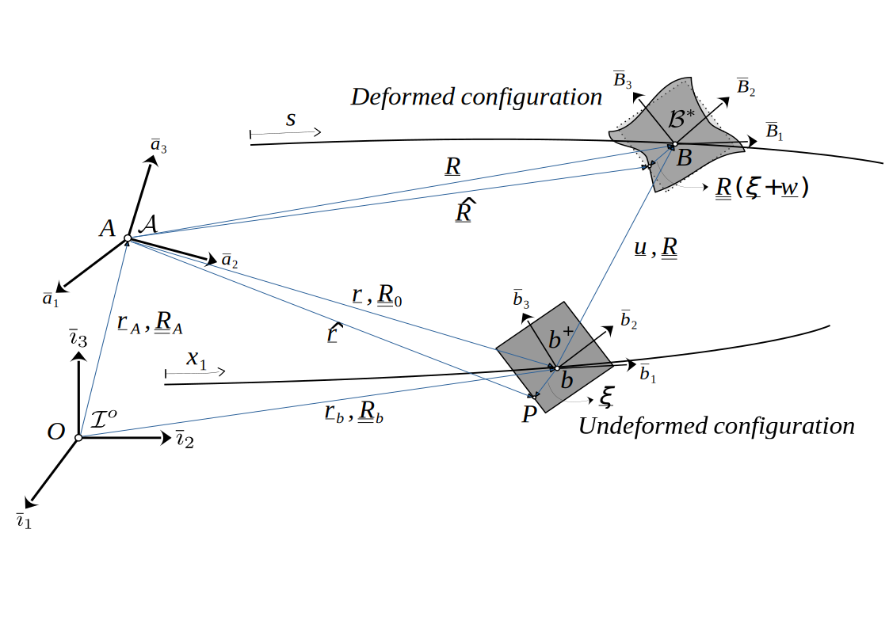

# Theory

## Structural formulation

The theory for the structural part of the code was developed by Hodges[^1], and practical implementation aspects are based on the works of Yu and Blair[^2] and Wang and Yu[^3]. Here we will outline only the basics for a better understanding of how to use the package. In the following, we use Bauchau's[^4] tensorial notation, in which first-order tensors (represented through vectors) are written with a single underline (``\underline{\cdot}``) and second- and higher-order tensors (represented through matrices) with a double underline (``\underline{\underline{\cdot}}``).

### Geometry and kinematics

The figure below illustrates the kinematics of the deformation of the beam. The primary basis (frame or reference) for the development of the theory is basis ``\mathcal{A}``, because the equations of motion are written in terms of tensors resolved in it (it can be thought of as a global, or body-attached basis). Its motion in an inertial, fixed basis ``\mathcal{I}^{\circ}`` is supposed to be known at all times. In AeroBeams, the user may input the motion of basis ``\mathcal{A}`` relative to ``\mathcal{I}^{\circ}`` through the vectorial displacement, initial rotation, velocities and/or accelerations (`u_A`,`p_A0`,`v_A`,`ω_A`,`vdot_A` and `ωdot_A` arguments) of that basis to the model with the function [`create_Model`](@ref create_Model).


*Kinematics of beam deformation*

In the undeformed configuration, the beam is idealized as an initially twisted and curved reference line with a defined cross-section at each point, shown as a  gray rectangle in the figure. Vector ``\underline{k}`` defines the undeformed beam's curvatures per unit length (``k_1`` is the twist and ``k_2`` and ``k_3`` are the bending curvatures), which may be input to the function [`create_Beam`](@ref create_Beam) through the argument `k`. The curvilinear coordinate ``x_1`` defines an intrinsic parametrization of the reference line, *i.e.*, denotes the arc-length along it. In this undeformed configuration, a basis ``b^+``, called the *undeformed beam basis*, is defined at each point along the reference line. This basis is fixed with respect to ``\mathcal{A}``, and tensor components resolved in it are denoted with a superscript ``(\cdot{})^{+}``. Rotation tensor ``\underline{\underline{R}}_0`` brings basis ``\mathcal{A}`` to basis ``b^+``. That rotation can be specified by the user to the function [`create_Beam`](@ref create_Beam) through the arguments representing the rotation parameters and the choice of rotation parametrization, `p0` and `rotationParametrization`, respectively.

!!! note
    Argument `rotationParametrization` is specific to the definition of `p0`. Internal computations of the systems of equations are done with Wiener-Milenkovic parameters, regardless of the choice of `rotationParametrization`.

Upon deformation, each point of the beam's undeformed reference line moves to a new point, whose loci define a new reference line in the deformed configuration. At each of such points is defined an orthonormal basis ``B^{\star}``, the *deformed beam basis*, and tensor components resolved in that basis are denoted with a superscript ``(\cdot{})^{\star}``.

### Equations of motion

The equations of motion are derived from Hamilton's principle:
```math
\int_{t_1}^{t_2} \int_{0}^{\ell} (\delta (\mathcal{K}-\mathcal{U}) + \overline{\delta \mathcal{W}}_{\textnormal{ext}} ) dx_1 dt = \overline{\delta\mathcal{A}}
```
where ``t_1`` and ``t_2`` represent initial and final instances of a time interval, ``\ell`` is the length of the beam, ``\delta`` is the variational operator, ``\mathcal{K}`` and ``\mathcal{U}`` are the kinetic energy and strain energy of the beam per unit length, respectively, ``\overline{\delta \mathcal{W}}_{\textnormal{ext}}`` is the virtual work of applied loads per unit length of the beam, and ``\overline{\delta\mathcal{A}}`` is the virtual action applied at the ends of the beam, at the initial and final times.

The form of the strain energy per unit length is assumed to be known as a function of the generalized strain measures, that is, ``\mathcal{U} = \mathcal{U}(\underline{\gamma}^{+},\underline{\kappa}^{+})``. Therefore, its variation can be written as
```math
\delta\mathcal{U} = \delta \underline{\gamma}^{+^T} \underline{F}^{\star} + \delta \underline{\kappa}^{+^T} \underline{M}^{\star}
```
in which ``\underline{F}^{\star}`` and ``\underline{M}^{\star}`` are the sectional force and moment resultants (*i.e.*, internal load vectors resolved in basis ``B^{\star}``) and ``\underline{\gamma}^{+}`` and ``\underline{\kappa}^{+}`` are the force and moment strains (*i.e.*, unidimensional strain measures). These quantities are related through the *generalized force-strain*, or *geometry-material constitutive relation*:
```math
\begin{bmatrix} \underline{F}^{\star} \\ \underline{M}^{\star} \end{bmatrix} = \underline{\underline{S}} \begin{bmatrix} \underline{\gamma}^+ \\ \underline{\kappa}^+ \end{bmatrix} \\
```
in which ``\underline{\underline{S}}`` is the *sectional stiffness matrix*. For simple cross-sections of isotropic materials it takes a diagonal form,
```math
\underline{\underline{S}} = \begin{bmatrix}
EA &   &   &   &   &    \\
   & GA_y  &   &   &  &  \\
   &   & GA_z  &   &  &  \\
   &   &   &  GJ   &  &  \\
   &   &   &   & EI_y &  \\
   &   &   &   &   & EI_z
\end{bmatrix}
```
where ``EA`` is the *axial stiffness*, ``GA_y`` and ``GA_z`` are the *shear stiffnesses*, ``GJ`` is the *torsional stiffness*, and ``EI_y`` and ``EI_z`` are the *bending stiffnesses*. However, for complex cross-sections of anisotropic materials, ``\underline{\underline{S}}`` may become a fully populated matrix that has to be numerically computed (for instance with [GXBeam.jl](https://github.com/byuflowlab/GXBeam.jl)). In AeroBeams, the sectional stiffness matrix of each element of the beam can be specified through the argument `S` to the function [`create_Beam`](@ref create_Beam).

!!! note
    If the beam has a uniform cross-section and material, a single-valued array may be input for `S`.

Now, the kinetic energy per unit length of the beam is
```math
\mathcal{K} = \frac{1}{2} ( \mu \underline{V}^{\star^T} \underline{V}^{\star} - 2\mu \underline{\Omega}^{\star^T} \tilde{V}^{\star} \underline{\eta}^{\star} + \underline{\Omega}^{\star^T} \underline{\underline{\iota}}^{\star} \underline{\Omega}^{\star} )
```
where ``\mu = \rho A`` is the *mass per unit length*, and ``\underline{\eta}^{\star}`` and ``\underline{\underline{\iota}}^{\star}`` are the *sectional first and second mass moments of inertia*, respectively, ``\underline{V}^{\star}`` is the *sectional velocity*, and ``\underline{\Omega}^{\star}`` is the *sectional angular velocity* of the beam. Note that the ``\tilde{(\cdot)}`` represents the skew-symmetric matrix.

Since the kinetic energy per unit length is a function of the sectional generalized velocities, *i.e.*, ``\mathcal{K} = \mathcal{K}(\underline{V}^{\star},\underline{\Omega}^{\star})``, its variation may be expressed as
```math
\delta\mathcal{K} = \delta \underline{V}^{\star^T} \underline{P}^{\star} + \delta \underline{\Omega}^{\star^T} \underline{H}^{\star}
```
in which ``\underline{P}^{\star}`` and ``\underline{H}^{\star}`` are the *sectional linear and angular momenta*. These are related to the sectional velocities through the *generalized momentum-velocity relationship*:
```math
\begin{bmatrix} \underline{P}^{\star} \\ \underline{H}^{\star} \end{bmatrix} = \underline{\underline{\mathcal{M}}} \begin{bmatrix} \underline{V}^{\star} \\ \underline{\Omega}^{\star} \end{bmatrix} \\
```
where the *sectional inertia matrix* is given by
```math
\underline{\mathcal{M}} = \begin{bmatrix} \mu \underline{\underline{I}}_3 & - \mu \tilde{\eta}^{\star} \\ 
    \mu \tilde{\eta}^{\star} & \underline{\underline{\iota}}^{\star} \end{bmatrix}
```

Just like the sectional stiffness matrix, the sectional inertia matrix may be analytically computable for simple cross-sections, but a numerical solution must be sought for arbitrary ones. In AeroBeams, the sectional stiffness matrix of each element of the beam can be specified through the argument `I` to the function [`create_Beam`](@ref create_Beam).

!!! note
    If the beam has a uniform cross-section and material, a single-valued array may be input for `I`.

The virtual work per unit length, ``\overline{\delta \mathcal{W}}_{\textnormal{ext}}``, may be written as a function of the displacements and rotations, ``\underline{u}`` and ``\underline{p}``, and the *externally applied distributed forces and moments*, ``\underline{f}`` and ``\underline{m}``. These loads may be input in AeroBeams either being dead (fixed direction) or follower, and being initially resolved in basis ``\mathcal{A}`` or ``b^+``, through the arguments `f_A_of_x1t`, `m_A_of_x1t`, `f_b_of_x1t`, `m_b_of_x1t`, `ff_A_of_x1t`, `mf_A_of_x1t`, `ff_b_of_x1t`, `mf_b_of_x1t` of the function [`create_Beam`](@ref create_Beam). As their names suggest, these can be functions of the beam arclength coordinate, ``x_1``, and of time, ``t``. In problems where the initial conditions are nonzero, the arguments `u0_of_x1`, `p0_of_x1`, `udot0_of_x1` and `pdot0_of_x1` can be input to [`create_Beam`](@ref create_Beam) to define the initial displacements and rotations (and their rates) resolved in basis ``b^+``.

!!! tip
    You can also use the functions [`add_loads_to_beam!`](@ref add_loads_to_beam!) and [`add_initial_displacements_and_velocities_to_beam!`](@ref add_initial_displacements_and_velocities_to_beam!).

!!! note
    Vectors ``\underline{f}`` and ``\underline{m}`` will also include any aerodynamic loads present.        

!!! note
    Concentrated dead and follower loads (and displacements/rotations) can also be defined as initially resolved in basis ``\mathcal{A}`` or ``b^+``, but they must be set as boundary conditions through the function [`create_BC`](@ref create_BC). 

With all the elements of the equations of motion at hand, we can adjoin the *kinematic constraints (generalized strain-displacement relationships)* to arrive at a *mixed variational statement* that encapsulates all the dynamics of this Timoshenko beam formulation. 

In the finite-element discretization, we maintain the displacements and rotation parameters resolved in basis ``\mathcal{A}``, ``\underline{u}`` and ``\underline{p}``, as well as the sectional loads and velocities, ``\underline{F}^{\star}``, ``\underline{M}^{\star}``, ``\underline{V}^{\star}`` and ``\underline{\Omega}^{\star}`` as *state variables*. That allows us to use the simplest shape functions (linear or constant) for these variables and therefore avoid numerical quadrature, besides yielding analytically computable system arrays. These states (and the complementary states ``\underline{\gamma}^{+}``, ``\underline{\kappa}^{+}``, ``\underline{P}^{\star}`` and ``\underline{H}^{\star}``) are assumed as constants over the beam element.

!!! note
    When an aerodynamic surface is attached to the beam, through the argument `aeroSurface` of [`create_Beam`](@ref create_Beam), the generated aerodynamic mesh is coincident with the structural mesh, since *strip theory* is assumed. Thus, each element will also have its associated aerodynamic states, ``\underline{\chi}``, and aerodynamic coefficients/loads.

Point inertias may be defined with the constructor [`PointInertia`](@ref PointInertia). They can be attached to a specific element of the beam through the argument `pointInertias` of the function [`create_Beam`](@ref create_Beam). Alternatively, one may use the function [`add_point_inertias_to_beam!`](@ref add_point_inertias_to_beam!). Their effect is to add to the attached element's sectional inertia matrix.

A similar situation arises with respect to linear springs, which can have one or both of their ends attached to nodes of a beam. They are instantiated with the function [`create_Spring`](@ref create_Spring), and can be passed to [`create_Beam`](@ref create_Beam) through the argument `springs`. Alternatively, one may use the functions [`add_springs_to_beam!`](@ref add_springs_to_beam!) and [`add_spring_to_beams!`](@ref add_spring_to_beams!).

## References
[^1]: Hodges, D. H. "Nonlinear Composite Beam Theory". 2006. American Institute of Aeronautics and Astronautics. [10.2514/4.866821](https://doi.org/10.2514/4.866821)

[^2]: Yu, W. and Blair, M. "GEBT: A general-purpose nonlinear analysis tool for composite beams". 2012. Composite Structures. [10.1016/j.compstruct.2012.04.007](https://doi.org/10.1016/j.compstruct.2012.04.007)

[^3]: Wang, Q. and Yu, W. "Geometrically nonlinear analysis of composite beams using Wiener-Milenković parameters". 2017. Journal of Renewable and Sustainable Energy. [10.1063/1.4985091](https://doi.org/10.1063/1.4985091)

[^4]: Bauchau, O. A. ["Flexible Multibody Dynamics"](https://link.springer.com/book/10.1007/978-94-007-0335-3). 2011. Springer.